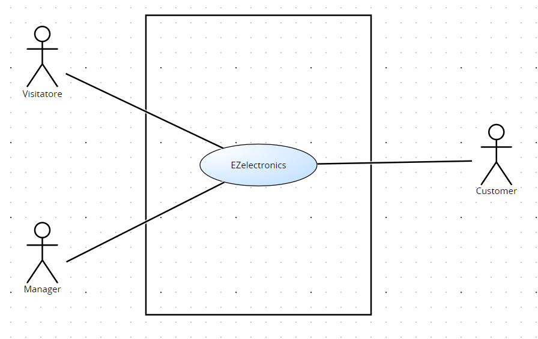
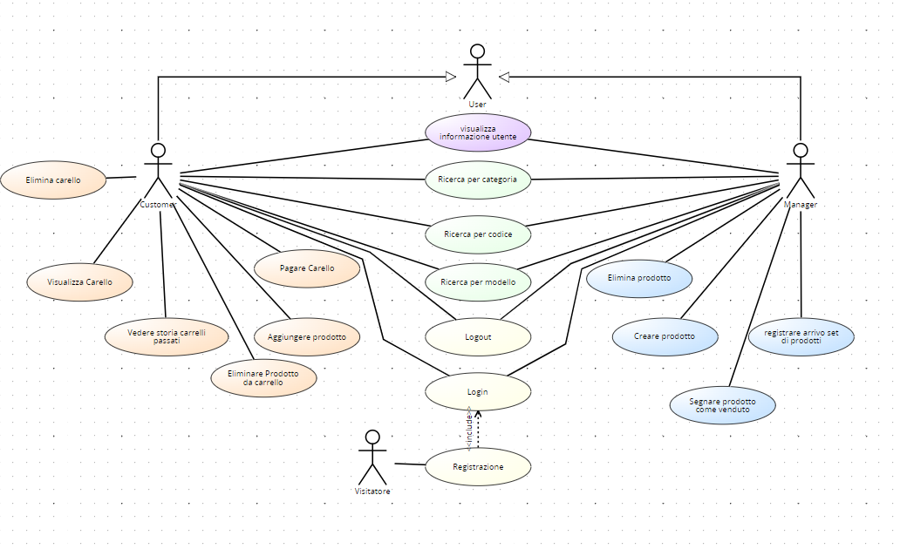
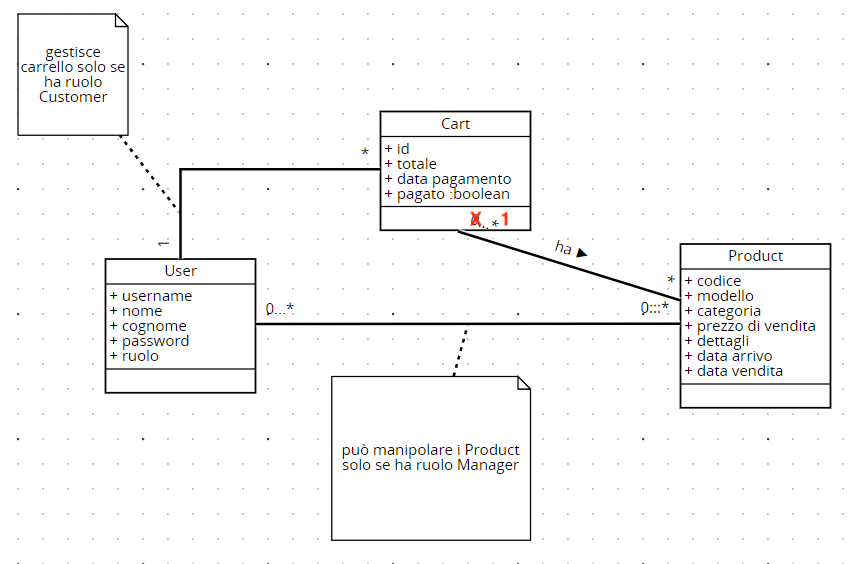
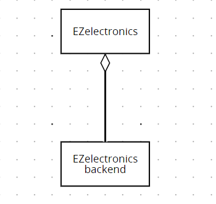
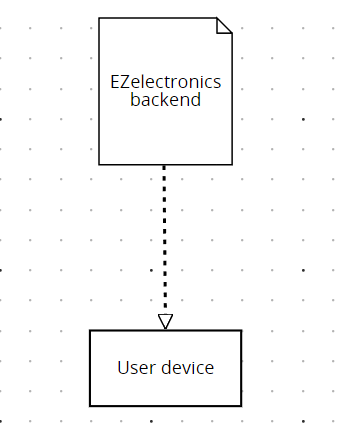

# Requirements Document - current EZElectronics

Date:

Version: V1 - description of EZElectronics in CURRENT form (as received by teachers)

| Version number | Change |
| :------------: | :----: |
|    1           |        |

# Contents

- [Requirements Document - current EZElectronics](#requirements-document---current-ezelectronics)
- [Contents](#contents)
- [Informal description](#informal-description)
- [Stakeholders](#stakeholders)
- [Context Diagram and interfaces](#context-diagram-and-interfaces)
  - [Context Diagram](#context-diagram)
  - [Interfaces](#interfaces)
- [Stories and personas](#stories-and-personas)
- [Functional and non functional requirements](#functional-and-non-functional-requirements)
  - [Functional Requirements](#functional-requirements)
  - [Non Functional Requirements](#non-functional-requirements)
- [Use case diagram and use cases](#use-case-diagram-and-use-cases)
  - [Use case diagram](#use-case-diagram)
    - [Use case 1, UC1](#use-case-1-uc1)
      - [Scenario 1.1](#scenario-11)
      - [Scenario 1.2](#scenario-12)
      - [Scenario 1.x](#scenario-1x)
    - [Use case 2, UC2](#use-case-2-uc2)
    - [Use case x, UCx](#use-case-x-ucx)
- [Glossary](#glossary)
- [System Design](#system-design)
- [Deployment Diagram](#deployment-diagram)

# Informal description

EZElectronics (read EaSy Electronics) is a software application designed to help managers of electronics stores to manage their products and offer them to customers through a dedicated website. Managers can assess the available products, record new ones, and confirm purchases. Customers can see available products, add them to a cart and see the history of their past purchases.

# Stakeholders

| Stakeholder name | Description |
| :--------------: | :---------: |
| Manager  |    Responsabile della gestione dei propri prodotti         |
|    Customer       |   Cliente che utilizza il sito per acquistare prodotti    |
| Visitatore| Utente che visita il sito senza registrarsi|

# Context Diagram and interfaces

## Context Diagram

## Interfaces

|   Actor   | Logical Interface | Physical Interface |
| :-------: | :---------------: | :----------------: |
| Customer |        GUI           |   Smartphone/PC                 |
| Manager  | GUI | Smartphone/PC|
| Visitatore  | GUI | Smartphone/PC|

# Stories and personas

### CUSTOMER
<b>Persona 1</b>
John, cliente abituale del negozio online, tecnologicamente competente e appassionato di nuove tecnologie. Desidera un'esperienza di shopping online veloce e conveniente.

<b>Storia</b>
John desidera acquistare un nuovo smartphone. Accede al negozio online, naviga tra i prodotti, aggiunge lo smartphone al carrello, effettua il checkout e completa il pagamento utilizzando la sua carta di credito.

<b>Persona 2</b>
Paolo, cliente non abituale, accede al sito per cercare uno specifico apparecchio elettronico e decide di accedere per la prima volta al sito 

<b>Storia</b>
Paolo ha smarrito il caricatore del suo laptop. Accede al sito, inserisce il modello sbagliato di modello del caricatore. Prima di acquistarlo, se ne accorge e lo elimina dal carrello per cercare il modello corretto

### MANAGER

<b>Persona 3</b>
Alice, manager del negozio online, responsabile delle operazioni quotidiane e della gestione del catalogo prodotti. Deve garantire che i nuovi prodotti vengano aggiunti correttamente al negozio online e siano disponibili per l'acquisto da parte dei clienti.

<b>Storia</b>
Alice riceve un nuovo stock di laptop da aggiungere al negozio online. Accede al pannello di amministrazione, registra l'arrivo dei nuovi laptop, specificando modello, prezzo di vendita e altri dettagli. I nuovi laptop sono ora disponibili per l'acquisto da parte dei clienti.

<b>Persona 4</b>
Riccardo, manager da poco del suo negozio online inizia ad approcciarsi ai suoi nuovi impegni e responsabilità di gestione dei prodotti.

<b>Storia</b>
Riccardo ha inserito tutti i prodotti nel suo negozio online, in pochi giorni lo stock degli Iphone 14 da lui inseriti vengono comprati dagli utenti. Riccardo, si accorge in tempo di questo cambiamento  e procede ad eliminare il prodotto dal negozio in attesa di un altro stock.

### VISITATORE
<b>Persona 5</b>
Roberto è interessato a visualizzare gli articoli sul sito di conseguenza procede a registrarsi.

# Functional and non functional requirements

## Functional Requirements

|  ID   | Description |
| :---: | :---------: |
|  <b>FR1</b>  |    <i>Gestione dei prodotti </i>         |
|  FR1.1  |  Creazione prodotto           |
| FR1.2 |    Segna prodotto come venduto        |
| FR1.3 | Registrazione arrivo di un set di prodotti dello stesso modello|  
|FR1.4| Visualizzazione tutti prodotti|
| FR1.5| Eliminazione prodotto|
| <b>FR2</b> |  <i>Ricerca dei prodotti</i>|
| FR2.1| Filtro per categoria|
| FR2.2| Filtro per modello|
| FR2.3| Filtro per codice|
|<b>FR3</b> | <i>Gestione del carrello</i> |
|FR3.1 | Visualizzazione carrello|
| FR3.2 | Aggiunta prodotto al carrelo |
| FR3.3| Rimozione prodotto dal carrello |
| FR3.4| Pagamento del totale del carrello |
| FR3.5 | Visualizzazione degli acquisti passati |
| FR3.6 | Eliminazione prodotto dal carrello |
| FR3.7 | Eliminazione carrello |
|<b>FR4</b> |<i>Autenticazione</i> |
|FR4.1 | Creazione account |
|FR4.2 |Login |
|FR4.3 |Logout |
|FR4.4 |Visualizzazione informazioni utente |

## Non Functional Requirements

|   ID    | Type (efficiency, reliability, ..) | Description | Refers to |
| :-----: | :--------------------------------: | :---------: | :-------: |
|  NFR1   |  Usabilità                                  |   No training          |   C/M        |
|  NFR2   |    Efficenza                                |   Tempi di risposta <0.5 sec (escludendo la rete)          |   C/M        |
|  NFR3   |    Affidabilità                                |     Recupero dei dati in caso di guasto o perdita di connessione        |     C/M      |
|  |                                    |     Utente non deve segnalare un problema nell’acquisto di un prodotto        |    C/M       |
|NFR4| Security| Massimo numero di errori nel prezzo < 1 anno |C/M|
|NFR5| Manutenibilità |Massimo 1 persona/ora per segnalazione errore|C/M|

# Use case diagram and use cases

## Use case diagram

### Use case 1, UC1

| Actors Involved  | User                                                                     |
| :--------------: | :------------------------------------------------------------------:     |
|   Precondition   | L'Utente non ha un account                                               |
|  Post condition  | Utente registrato                                                        |
| Nominal Scenario | Scenario 1.1                                                             |
|     Variants     | ---                                                                      |
|    Exceptions    | Scenario 1.2                                                             |

##### Scenario 1.1

|  Scenario 1.1  | Registrazione User                                                         |
| :------------: | :------------------------------------------------------------------------: |
|  Precondition  | L'user non ha account                                                      |
| Post condition | User Registrato                                                            |
|     Step#      |                                Description                                 |
|       1        | User: chiede di registrarsi                                                |
|       2        | Sistema: chiede nome, cognome, username, password, ruolo                   |
|       3        | User: inserisce nome, cognome, username, password, ruolo                   |
|       4        | Sistema: legge nome, cognome, username, password, ruolo                    |
|       5        | Sistema: controlla che username non sia già associato a un altro account   |
|       6        | Sistema: crea il nuovo account per l’user e inserisce le sue informazioni nel database |

##### Scenario 1.2

|  Scenario 1.2  | Utente già registrato                                                      |
| :------------: | :------------------------------------------------------------------------: |
|  Precondition  | L'Utente ha un account                                                     |
| Post condition | Registrazione fallita                                                      |
|     Step#      |                                Description                                 |
|       1        | User: chiede di registrarsi                                                |
|       2        | Sistema: chiede nome, cognome, username, password, ruolo                   |
|       3        | User: inserisce nome, cognome, username, password, ruolo                   |
|       4        | Sistema: legge nome, cognome, username, password, ruolo                    |
|       5        | Sistema: controlla che username non sia già associato a un altro account. Username è già stata usata e invia un messaggio di errore   |

### Use case 2, UC2

| Actors Involved  | User/Manager                                                             |
| :--------------: | :------------------------------------------------------------------:     |
|   Precondition   | User/Manager non loggato ma registrato                                   |
|  Post condition  | User/Manager loggato                                                     |
| Nominal Scenario | Scenario 2.1                                                             |
|     Variants     |                                                                          |
|    Exceptions    | Scenario 2.2, 2.3                                                        |

##### Scenario 2.1

|  Scenario 2.1  | Login                                                                      |
| :------------: | :------------------------------------------------------------------------: |
|  Precondition  | User/Manager non loggato ma registrato                                     |
| Post condition | User/Manager loggato                                                       |
|     Step#      |                                Description                                 |
|       1        | Sistema: chiede username e password                                        |
|       2        | User/Manager: inserisce username e password                                |
|       3        | Sistema: legge username e password e controlla che l’utente non sia già loggato |
|       4        | Sistema: controlla che la password coincida con quella fornita al momento della registrazione. La password coincide, l’utente è loggato                 |

##### Scenario 2.2

|  Scenario 2.2  | Password sbagliata                                                         |
| :------------: | :------------------------------------------------------------------------: |
|  Precondition  | User/Manager non loggato ma registrato                                     |
| Post condition | User/Manager non loggato                                                   |
|     Step#      |                                Description                                 |
|       1        | Sistema: chiede username e password                                        |
|       2        | User/Manager: inserisce username e password                                |
|       3        | Sistema: legge username e password e controlla che l’utente non sia già loggato |
|       4        | Sistema: controlla che la password coincida con quella fornita al momento della registrazione. La password non coincide, l’utente non viene autorizzato |

##### Scenario 2.3

|  Scenario 2.3  |  Utente non registrato                                                     |
| :------------: | :------------------------------------------------------------------------: |
|  Precondition  | User/Manager non loggato e non registrato                                  |
| Post condition | User/Manager non loggato                                                   |
|     Step#      |                                Description                                 |
|       1        | Sistema: chiede username e password                                        |
|       2        | User/Manager: inserisce username e password                                |
|       3        | Sistema: legge username e password e controlla che l’utente non sia già loggato |
|       4        | Sistema: cerca l’username fornito nel database per confrontare la password ma non trova l’username. L’utente non viene autorizzato |

### Use case 3, UC3

| Actors Involved  | User/Manager                                                             |
| :--------------: | :------------------------------------------------------------------:     |
|   Precondition   | User/Manager loggato                                                     |
|  Post condition  | User/Manager non loggato                                                 |
| Nominal Scenario | Scenario 3.1                                                             |
|     Variants     |                                                                          |
|    Exceptions    | Scenario 3.2                                                             |

##### Scenario 3.1

|  Scenario 3.1  | Logout                                                                     |
| :------------: | :------------------------------------------------------------------------: |
|  Precondition  | Utente loggato                                                             |
| Post condition | Utente non loggato                                                         |
|     Step#      |                                Description                                 |
|       1        | Utente: richiesta logout                                                   |
|       2        | Sistema: ricerca utente, ricerca cockie                                    |
|       3        | Sistema: rimuove autorizzazione utente loggato                             |
|       4        | Sistema: mostra un messaggio di conferma                                   |

##### Scenario 3.2

|  Scenario 3.2  | Utente ha già fatto logout                                                 |
| :------------: | :------------------------------------------------------------------------: |
|  Precondition  | Utente non loggato                                                         |
| Post condition | Utente non loggato                                                         |
|     Step#      |                                Description                                 |
|       1        | Utente: richiesta logout                                                   |
|       2        | Sistema: ricerca utente, ricerca cockie                                    |
|       3        | Sistema: trova che l’utente non è loggato                                  |
|       4        | Sistema: mostra un messaggio di errore                                     |

### Use case 4, UC4

| Actors Involved  | Manager                                                                  |
| :--------------: | :------------------------------------------------------------------:     |
|   Precondition   | Manager loggato                                                          |
|  Post condition  | Creazione Prodotto                                                       |
| Nominal Scenario | Scenario 4.1                                                             |
|     Variants     | Scenario 4.2, 4.3                                                        |
|    Exceptions    | Scenario 4.4, 4.5, 4.6                                                   |

##### Scenario 4.1

|  Scenario 4.1  | Creazione Prodotto con Arrival time                                        |
| :------------: | :------------------------------------------------------------------------: |
|  Precondition  | Manager loggato                                                            |
| Post condition | Nuovo prodotto creato                                                      |
|     Step#      |                                Description                                 |
|       1        | Manager: Richiesta di creare un nuovo prodotto                             |
|       2        | Sistema: Chiede code, SellingPrice, model, category(Smartphone, Laptop, Appliance), details (può essere vuoto), ArrivalDate (optional)                                                                        |
|       3        | Manager: Inserisce campi                                                   |
|       4        | Sistema: Controlla se il prodotto è già esistente nel database, che data aggiunta prodotto non sia dopo la data corrente e che non siano vuoti campi obbligatori                                         |
|       5        | Sistema: Crea nuovo prodotto                                               |

##### Scenario 4.2

|  Scenario 4.2  | Creazione prodotto senza Arrival time                                      |
| :------------: | :------------------------------------------------------------------------: |
|  Precondition  | Manager loggato                                                            |
| Post condition | Nuovo prodotto creato                                                      |
|     Step#      |                                Description                                 |
|       1        | Manager: Richiesta di creare un nuovo prodotto                             |
|       2        | Sistema: Chiede code, SellingPrice, model, category(Smartphone, Laptop, Appliance), details (può essere vuoto), ArrivalDate (optional)                                                                        |
|       3        | Manager: Inserisce campi ma lascia vuoto ArrivalDate                       |
|       4        | Sistema: Controlla se il prodotto è già esistente nel database, che data aggiunta prodotto non sia dopo la data corrente e che non siano vuoti campi obbligatori                                         |
|       5        | Sistema: Inserisce in automatico Arrival Data = Current Data               |
|       6        | Sistema: Crea nuovo prodotto                                               |

##### Scenario 4.3

|  Scenario 4.3  | Creazione prodotto con campo vuoto                                         |
| :------------: | :------------------------------------------------------------------------: |
|  Precondition  | Manager loggato                                                            |
| Post condition | Nuovo prodotto creato                                                      |
|     Step#      |                                Description                                 |
|       1        | Manager: Richiesta di creare un nuovo prodotto                             |
|       2        | Sistema: Chiede code, sellingPrice, model, category(Smartphone, Laptop, Appliance), details (può essere vuoto), ArrivalDate (optional)                                                                        |
|       3        | Manager: Inserisce campi                                                   |
|       4        | Sistema: Controlla se il prodotto è già esistente nel database, che data aggiunta prodotto non sia dopo la data corrente e che non siano vuoti campi obbligatori                                         |
|       5        | Sistema: Crea nuovo prodotto                                               |

##### Scenario 4.4

|  Scenario 4.4  | Creazione prodotto con campo obbligatorio vuoto                            |
| :------------: | :------------------------------------------------------------------------: |
|  Precondition  | Manager loggato                                                            |
| Post condition | Nuovo prodotto non creato                                                  |
|     Step#      |                                Description                                 |
|       1        | Manager: Richiesta di creare un nuovo prodotto                             |
|       2        | Sistema: Chiede code, sellingPrice, model, category(Smartphone, Laptop, Appliance), details (può essere vuoto), ArrivalDate (optional)                                                                        |
|       3        | Manager: Inserisce campi ma lascia vuoto campo obbligatorio                |
|       4        | Sistema: Controlla se il prodotto è già esistente nel database, che data aggiunta prodotto non sia dopo la data corrente e che non siano vuoti campi obbligatori                                         |
|       5        | Sistema: Chiede di inserire campi obbligatori                              |

##### Scenario 4.5

|  Scenario 4.5  | Creazione prodotto con Codice Prodotto esiste nel database                 |
| :------------: | :------------------------------------------------------------------------: |
|  Precondition  | Il manager è loggato                                                       |
| Post condition | Prodotto non aggiunto                                                      |
|     Step#      |                                Description                                 |
|       1        | Manager: chiede di aggiungere un prodotto                                  |
|       2        | Sistema: chiede codice, prezzo, modello (uno tra Smartphone, Laptop, Apparecchio), categoria, dettagli (può essere vuota), giorno di arrivo (se assente viene inserita in automatico data corrente)       |
|       3        | Manager: inserisce campi                                                   |
|       4        | Sistema: controlla se il prodotto è già esistente nel database e controlla che data aggiunta prodotto non sia dopo la data corrente                                                                         |
|       5        | Sistema: ritorna errore 409                                                |

##### Scenario 4.6

|  Scenario 4.6  | Creazione prodotto con data aggiunta prodotto dopo Data corrente           |
| :------------: | :------------------------------------------------------------------------: |
|  Precondition  | Il manager è loggato                                                       |
| Post condition | Prodotto non aggiunto                                                      |
|     Step#      |                                Description                                 |
|       1        | Manager: chiede di aggiungere un prodotto                                  |
|       2        | Sistema: chiede codice, prezzo, modello (uno tra Smartphone, Laptop, Apparecchio), categoria, dettagli (può essere vuota), giorno di arrivo (se assente viene inserita in automatico data corrente)       |
|       3        | Manager: inserisce campi                                                   |
|       4        | Sistema: controlla se il prodotto è già esistente nel database e controlla che data aggiunta prodotto non sia dopo la data corrente                                                                         |
|       5        | Sistema: ritorna errore                                                    |

### Use case 5, UC5

| Actors Involved  | Manager                                                                  |
| :--------------: | :------------------------------------------------------------------:     |
|   Precondition   | Manager loggato                                                          |
|  Post condition  | Registrare set di prodotti                                               |
| Nominal Scenario | Scenario 5.1                                                             |
|     Variants     | Scenario 5.2, 5.3                                                        |
|    Exceptions    | Scenario 5.4, 5.5, 5.6                                                   |

##### Scenario 5.1

|  Scenario 5.1  | Registrare set di Prodotto con Arrival time                                |
| :------------: | :------------------------------------------------------------------------: |
|  Precondition  | Manager loggato                                                            |
| Post condition | Nuovo set di prodotti registrati                                           |
|     Step#      |                                Description                                 |
|       1        | Manager: Richiesta di registrare un set di prodotti                        |
|       2        | Sistema: Chiede code, sellingPrice, model, category(Smartphone, Laptop, Appliance), details (può essere vuoto), ArrivalDate (optional), quantity                                                              |
|       3        | Manager: Inserisce campi                                                   |
|       4        | Sistema: Controlla se il prodotto è già esistente nel database, che data aggiunta prodotto non sia dopo la data corrente e che non siano vuoti campi obbligatori                                         |
|       5        | Sistema: Registra set di prodotti                                          |

##### Scenario 5.2

|  Scenario 5.2  | Registrare set di prodotti senza Arrival time                              |
| :------------: | :------------------------------------------------------------------------: |
|  Precondition  | Manager loggato                                                            |
| Post condition | Nuovo prodotto creato                                                      |
|     Step#      |                                Description                                 |
|       1        | Manager: Richiesta di registrare un set di prodotti                        |
|       2        | Sistema: Chiede code, sellingPrice, model, category(Smartphone, Laptop, Appliance), details (può essere vuoto), ArrivalDate (optional), quantity                                                              |
|       3        | Manager: Inserisce campi ma lascia vuoto ArrivalDate                       |
|       4        | Sistema: Controlla se il prodotto è già esistente nel database, che data aggiunta prodotto non sia dopo la data corrente e che non siano vuoti campi obbligatori                                         |
|       5        | Sistema: Inserisce in automatico Arrival Data = Current Data               |
|       6        | Sistema: Registra set di prodotti                                          |

##### Scenario 5.3

|  Scenario 5.3  | Registrare set di prodotti con campo vuoto                                 |
| :------------: | :------------------------------------------------------------------------: |
|  Precondition  | Manager loggato                                                            |
| Post condition | Nuovo prodotto creato                                                      |
|     Step#      |                                Description                                 |
|       1        | Manager: Richiesta di registrare un set di prodotti                        |
|       2        | Sistema: Chiede code, sellingPrice, model, category(Smartphone, Laptop, Appliance), details (può essere vuoto), ArrivalDate (optional), quantity                                                              |
|       3        | Manager: Inserisce campi                                                   |
|       4        | Sistema: Controlla se il prodotto è già esistente nel database, che data aggiunta prodotto non sia dopo la data corrente e che non siano vuoti campi obbligatori                                         |
|       5        | Sistema: Registra set di prodotti                                          |

##### Scenario 5.4

|  Scenario 5.4  | Registrare set di prodotti con campo obbligatorio vuoto                    |
| :------------: | :------------------------------------------------------------------------: |
|  Precondition  | Manager loggato                                                            |
| Post condition | Nuovo prodotto non creato                                                  |
|     Step#      |                                Description                                 |
|       1        | Manager: Richiesta di registrare un set di prodotti                        |
|       2        | Sistema: Chiede code, sellingPrice, model, category(Smartphone, Laptop, Appliance), details (può essere vuoto), ArrivalDate (optional), quantity                                                              |
|       3        | Manager: Inserisce campi ma lascia vuoto campo obbligatorio                |
|       4        | Sistema: Controlla se il prodotto è già esistente nel database, che data aggiunta prodotto non sia dopo la data corrente e che non siano vuoti campi obbligatori                                         |
|       5        | Sistema: Chiede di inserire campi obbligatori                              |

##### Scenario 5.5

|  Scenario 5.5  | Registrare set di prodotti con Codice Prodotto esiste nel database         |
| :------------: | :------------------------------------------------------------------------: |
|  Precondition  | Il manager è loggato                                                       |
| Post condition | Prodotto non aggiunto                                                      |
|     Step#      |                                Description                                 |
|       1        | Manager: Richiesta di registrare un set di prodotti                        |
|       2        | Sistema: Chiede code, sellingPrice, model, category(Smartphone, Laptop, Appliance), details (può essere vuoto), ArrivalDate (optional), quantity                                                              |
|       3        | Manager: inserisce campi                                                   |
|       4        | Sistema: controlla se il prodotto è già esistente nel database e controlla che data aggiunta prodotto non sia dopo la data corrente                                                                         |
|       5        | Sistema: ritorna errore 409                                                |

##### Scenario 5.6

|  Scenario 5.6  | Registrare set di prodotti con data aggiunta prodotto dopo Data corrente   |
| :------------: | :------------------------------------------------------------------------: |
|  Precondition  | Il manager è loggato                                                       |
| Post condition | Prodotto non aggiunto                                                      |
|     Step#      |                                Description                                 |
|       1        | Manager: Richiesta di registrare un set di prodotti                        |
|       2        | Sistema: Chiede code, sellingPrice, model, category(Smartphone, Laptop, Appliance), details (può essere vuoto), ArrivalDate (optional), quantity                                                              |
|       3        | Manager: inserisce campi                                                   |
|       4        | Sistema: controlla se il prodotto è già esistente nel database e controlla che data aggiunta prodotto non sia dopo la data corrente                                                                         |
|       5        | Sistema: ritorna errore                                                    |

### Use case 6, UC6

| Actors Involved  | Manager                                                                  |
| :--------------: | :------------------------------------------------------------------:     |
|   Precondition   | Manager loggato                                                          |
|  Post condition  | Segnare prodotto come venduto                                            |
| Nominal Scenario | Scenario 6.1                                                             |
|     Variants     | Scenario 6.2                                                             |
|    Exceptions    | Scenario 6.3, 6.4, 6.5, 6.6                                              |

##### Scenario 6.1

|  Scenario 6.1  | Segnare prodotto venduto con SellingDate inserito dal Manager              |
| :------------: | :------------------------------------------------------------------------: |
|  Precondition  | Manager loggato                                                            |
| Post condition | Segnare prodotto come venduto                                              |
|     Step#      |                                Description                                 |
|       1        | Manager: richiede di segnare un prodotto come venduto                      |
|       2        | Sistema: chiede al manager di inserire codice prodotto                     |
|       3        | Manager: inserisce codice come parametro della richiesta e SellingDate come corpo della richiesta |
|       4        | Sistema: trova il prodotto con il codice corrispondente e controlla SellingData |
|       5        | Sistema: segna il prodotto come venduto                                    |

##### Scenario 6.2

|  Scenario 6.2  | Segnare prodotto venduto con SellingDate non inserito dal Manager          |
| :------------: | :------------------------------------------------------------------------: |
|  Precondition  | Manager loggato                                                            |
| Post condition | Segnare prodotto come venduto                                              |
|     Step#      |                                Description                                 |
|       1        | Manager: richiede di segnare un prodotto come venduto                      |
|       2        | Sistema: chiede al manager di inserire codice prodotto                     |
|       3        | Manager: inserisce codice come parametro della richiesta                   |
|       4        | Sistema: trova il prodotto con il codice corrispondente e inserisce SellingData = CurrentDate |
|       5        | Sistema: segna il prodotto come venduto                                    |

##### Scenario 6.3

|  Scenario 6.3  | Codice prodotto inesistente                                                |
| :------------: | :------------------------------------------------------------------------: |
|  Precondition  | Manager loggato                                                            |
| Post condition | Errore 404                                                                 |
|     Step#      |                                Description                                 |
|       1        | Manager: richiede di segnare un prodotto come venduto                      |
|       2        | Sistema: chiede al manager di inserire codice prodotto                     |
|       3        | Manager: inserisce codice come parametro della richiesta                   |
|       4        | Sistema: non trova il prodotto con il codice corrispondente                |
|       5        | Sistema: restituisce errore 404                                            |

##### Scenario 6.4

|  Scenario 6.4  | Errore SellingData > CurrentDate                                           |
| :------------: | :------------------------------------------------------------------------: |
|  Precondition  | Manager loggato                                                            |
| Post condition | Errore                                                                     |
|     Step#      |                                Description                                 |
|       1        | Manager: richiede di segnare un prodotto come venduto                      |
|       2        | Sistema: chiede al manager di inserire codice prodotto                     |
|       3        | Manager: inserisce codice come parametro della richiesta e SellingDate come corpo della richiesta |
|       4        | Sistema: trova il prodotto con il codice corrispondente e controlla SellingDate |
|       5        | Sistema: restituisce errore perché SellingData > CurrentDate               |

##### Scenario 6.5

|  Scenario 6.5  | Errore SellingData < ArrivalData                                           |
| :------------: | :------------------------------------------------------------------------: |
|  Precondition  | Manager loggato                                                            |
| Post condition | Errore                                                                     |
|     Step#      |                                Description                                 |
|       1        | Manager: richiede di segnare un prodotto come venduto                      |
|       2        | Sistema: chiede al manager di inserire codice prodotto                     |
|       3        | Manager: inserisce codice come parametro della richiesta e SellingDate come corpo della richiesta |
|       4        | Sistema: trova il prodotto con il codice corrispondente e controlla SellingDate |
|       5        | Sistema: restituisce errore perché SellingData < ArrivalDate               |

##### Scenario 6.6

|  Scenario 6.6  | Segnare prodotto venduto di un prodotto già venduto                        |
| :------------: | :------------------------------------------------------------------------: |
|  Precondition  | Manager loggato                                                            |
| Post condition | Errore                                                                     |
|     Step#      |                                Description                                 |
|       1        | Manager: richiede di segnare un prodotto come venduto                      |
|       2        | Sistema: chiede al manager di inserire codice prodotto                     |
|       3        | Manager: inserisce codice come parametro della richiesta                   |
|       4        | Sistema: trova il prodotto con il codice corrispondente                    |
|       5        | Sistema: restituisce errore perché il prodotto è già stato venduto (ha già SellingDate)|

### Use case 7, UC7

| Actors Involved  | User                                                                     |
| :--------------: | :------------------------------------------------------------------:     |
|   Precondition   | Utente loggato                                                           |
|  Post condition  | Visualizzazione prodotti                                                 |
| Nominal Scenario | Scenario 7.1, 7.4, 7.6, 7.9                                              |
|     Variants     | Scenario 7.2, 7.3, 7.7, 7.8, 7.10, 7.11                                  |
|    Exceptions    | Scenario 7.5                                                             |

##### Scenario 7.1

|  Scenario 7.1  | Visulizza tutti i prodotti                                                 |
| :------------: | :------------------------------------------------------------------------: |
|  Precondition  | Utente loggato                                                             |
| Post condition | Mostra tutti i prodotti                                                    |
|     Step#      |                                Description                                 |
|       1        | Utente: chiede la visualizzazione di tutti i prodotti                      |
|       2        | Sistema: recupera tutti i prodotti e li mostra                             |

##### Scenario 7.2

|  Scenario 7.2  | Visulizza tutti i prodotti venduti                                         |
| :------------: | :------------------------------------------------------------------------: |
|  Precondition  | Utente loggato                                                             |
| Post condition | Mostra tutti i prodotti venduti                                            |
|     Step#      |                                Description                                 |
|       1        | Utente: chiede la visualizzazione di tutti i prodotti venduti (sold = yes) |
|       2        | Sistema: recupera tutti i prodotti venduti e li mostra                     |

##### Scenario 7.3

|  Scenario 7.3  | Visulizza tutti i prodotti non venduti                                     |
| :------------: | :------------------------------------------------------------------------: |
|  Precondition  | Utente loggato                                                             |
| Post condition | Mostra tutti i prodotti non venduti                                        |
|     Step#      |                                Description                                 |
|       1        | Utente: chiede la visualizzazione di tutti i prodotti non venduti (sold = no)|
|       2        | Sistema: recupera tutti i prodotti non venduti e li mostra                 |

##### Scenario 7.4

|  Scenario 7.4  | Ricerca per codice                                                         |
| :------------: | :------------------------------------------------------------------------: |
|  Precondition  | Utente loggato                                                             |
| Post condition | Mostra prodotti per codice                                                 |
|     Step#      |                                Description                                 |
|       1        | Utente: inserisce il codice del prodotto da mostare                        |
|       2        | Sistema: controlla l'esistenza del codice                                  |
|       3        | Sistema: mostra il prodotto con il codice corrispondente                   |

##### Scenario 7.5

|  Scenario 7.5  | Codice non esistente                                                       |
| :------------: | :------------------------------------------------------------------------: |
|  Precondition  | Utente loggato                                                             |
| Post condition | Errore 404                                                                 |
|     Step#      |                                Description                                 |
|       1        | Utente: inserisce il codice del prodotto da mostare                        |
|       2        | Sistema: controlla l'esistenza del codice                                  |
|       3        | Sistema: restituisce errore 404                                            |

##### Scenario 7.6

|  Scenario 7.6  | Ricerca per categoria                                                      |
| :------------: | :------------------------------------------------------------------------: |
|  Precondition  | Utente loggato                                                             |
| Post condition | Mostra prodotti per categoria                                              |
|     Step#      |                                Description                                 |
|       1        | Utente: inserisce la categoria da mostare                                  |
|       2        | Sistema: controlla l'esistenza della categoria (Smartphone, Laptop, Appliance)|
|       3        | Sistema: mostra i prodotti appartenti a quella categoria                   |

##### Scenario 7.7

|  Scenario 7.7  | Ricerca per categoria prodotti venduti                                     |
| :------------: | :------------------------------------------------------------------------: |
|  Precondition  | Utente loggato                                                             |
| Post condition | Mostra prodotti venduti per categoria                                      |
|     Step#      |                                Description                                 |
|       1        | Utente: inserisce la categoria da mostare con sold = yes                   |
|       2        | Sistema: controlla l'esistenza della categoria (Smartphone, Laptop, Appliance)|
|       3        | Sistema: mostra i prodotti venduti appartenti a quella categoria           |

##### Scenario 7.8

|  Scenario 7.8  | Ricerca per categoria prodotti non venduti                                 |
| :------------: | :------------------------------------------------------------------------: |
|  Precondition  | Utente loggato                                                             |
| Post condition | Mostra prodotti non venduti per categoria                                  |
|     Step#      |                                Description                                 |
|       1        | Utente: inserisce la categoria da mostare con sold = no                    |
|       2        | Sistema: controlla l'esistenza della categoria (Smartphone, Laptop, Appliance)|
|       3        | Sistema: mostra i prodotti venduti appartenti a quella categoria           |

##### Scenario 7.9

|  Scenario 7.9  | Ricerca per modello                                                        |
| :------------: | :------------------------------------------------------------------------: |
|  Precondition  | Utente loggato                                                             |
| Post condition | Mostra prodotti per modello                                                |
|     Step#      |                                Description                                 |
|       1        | Utente: inserisce il modello da mostare                                    |
|       2        | Sistema: controlla l'esistenza del modello                                 |
|       3        | Sistema: mostra i prodotti per quel modello                                |

##### Scenario 7.10

|  Scenario 7.10 | Ricerca per modello prodotti venduti                                       |
| :------------: | :------------------------------------------------------------------------: |
|  Precondition  | Utente loggato                                                             |
| Post condition | Mostra prodotti venduti per modello                                        |
|     Step#      |                                Description                                 |
|       1        | Utente: inserisce il modello da mostare con sold = yes                     |
|       2        | Sistema: controlla l'esistenza del modello                                 |
|       3        | Sistema: mostra i prodotti venduti per quel modello                        |

##### Scenario 7.11

|  Scenario 7.11 | Ricerca per modello prodotti non venduti                                   |
| :------------: | :------------------------------------------------------------------------: |
|  Precondition  | Utente loggato                                                             |
| Post condition | Mostra prodotti non venduti per modello                                    |
|     Step#      |                                Description                                 |
|       1        | Utente: inserisce il modello da mostare con sold = no                      |
|       2        | Sistema: controlla l'esistenza del modello                                 |
|       3        | Sistema: mostra i prodotti venduti per quel modello                        |

### Use case 8, UC8

| Actors Involved  | Manager                                                                  |
| :--------------: | :------------------------------------------------------------------:     |
|   Precondition   | Manager loggato                                                          |
|  Post condition  | Eliminare Prodotto                                                       |
| Nominal Scenario | Scenario 8.1                                                             |
|     Variants     |                                                                          |
|    Exceptions    | Scenario 8.2                                                             |

##### Scenario 8.1

|  Scenario 8.1  | Eliminare prodotto                                                         |
| :------------: | :------------------------------------------------------------------------: |
|  Precondition  | Manager loggato                                                            |
| Post condition | Prodotto eliminato                                                         |
|     Step#      |                                Description                                 |
|       1        | Manager: Richiesta di eliminare un prodotto                                |
|       2        | Sistema: richiede codice prodotto da eliminare                             |
|       3        | Manager: inserisce codice                                                  |
|       4        | Sistema: elimina prodotto                                                  |

##### Scenario 8.2

|  Scenario 8.2  | Codice prodotto inesistente                                                |
| :------------: | :------------------------------------------------------------------------: |
|  Precondition  | Manager loggato                                                            |
| Post condition | Erorre 404                                                                 |
|     Step#      |                                Description                                 |
|       1        | Manager: Richiesta di eliminare un prodotto                                |
|       2        | Sistema: richiede codice prodotto da eliminare                             |
|       3        | Manager: inserisce codice                                                  |
|       4        | Sistema: restituisce errore 404 perché non esiste prodotto con codice corrispondete |

### Use case 9, UC9

| Actors Involved  | Customer                                                                 |
| :--------------: | :------------------------------------------------------------------:     |
|   Precondition   | Il Customer è loggato                                                    |
|  Post condition  | Visualizzazione carrello                                                 |
| Nominal Scenario | Scenario 9.1                                                             |
|     Variants     |                                                                          |
|    Exceptions    |                                                                          |

##### Scenario 9.1

|  Scenario 9.1  | Visualizzazione carrello                                                   |
| :------------: | :------------------------------------------------------------------------: |
|  Precondition  | Customer loggato                                                           |
| Post condition | Carrello visualizzato                                                      |
|     Step#      |                                Description                                 |
|       1        | Customer: chiede di visualizzare il carrello                               |
|       2        | Sistema: restituisce il carrello del Customer loggato                      |

### Use case 10, UC10

| Actors Involved  | Customer                                                            |
| :--------------: | :------------------------------------------------------------------:     |
|   Precondition   | Il Customer è loggato                                                 |
|  Post condition  | Aggiungere prodotto al carrello        |
| Nominal Scenario | Scenario 10.1                                                             |
|     Variants     |                                                                          |
|    Exceptions    | Scenario 10.2, 10.3, 10.4                                                                   |

##### Scenario 10.1

|  Scenario 10.1  | Aggiungere prodotto al carrello                                                     |
| :------------: | :------------------------------------------------------------------------: |
|  Precondition  | Customer loggato                                                                         |
| Post condition | Prodotto aggiunto al carrello                                                      |
|     Step#      |                                Description                                 |
|       1        | Customer: chiede di aggiungere prodotto al carrello                                            |
|       2        | Sistema: richiede codice del prodotto da aggiungere                          |
|       3        | Customer: inserisce codice del prodotto                                           |
|       4        | Sistema: aggiunge al carrello                         |

##### Scenario 10.2

|  Scenario 10.2  | Codice inesistente                                                     |
| :------------: | :------------------------------------------------------------------------: |
|  Precondition  | Customer loggato                                                                         |
| Post condition | Errore 404                                                    |
|     Step#      |                                Description                                 |
|       1        | Customer: chiede di aggiungere prodotto al carrello                                            |
|       2        | Sistema: richiede codice del prodotto da aggiungere                          |
|       3        | Customer: inserisce codice del prodotto                                           |
|       4        | Sistema: restituisce errore 404 perché codice inesistente                         |

##### Scenario 10.3

|  Scenario 10.3  | Prodotto già presente in un altro carrello                                                    |
| :------------: | :------------------------------------------------------------------------: |
|  Precondition  | Customer loggato                                                                         |
| Post condition | Errore 409                                                    |
|     Step#      |                                Description                                 |
|       1        | Customer: chiede di aggiungere prodotto al carrello                                            |
|       2        | Sistema: richiede codice del prodotto da aggiungere                          |
|       3        | Customer: inserisce codice del prodotto                                           |
|       4        | Sistema: restituisce errore 409 perché prodotto presente in un altro carrello                         |

##### Scenario 10.4

|  Scenario 10.4  | Prodotto già venduto                                                   |
| :------------: | :------------------------------------------------------------------------: |
|  Precondition  | Customer loggato                                                                         |
| Post condition | Errore 409                                                    |
|     Step#      |                                Description                                 |
|       1        | Customer: chiede di aggiungere prodotto al carrello                                            |
|       2        | Sistema: richiede codice del prodotto da aggiungere                          |
|       3        | Customer: inserisce codice del prodotto                                           |
|       4        | Sistema: restituisce errore 409 perché prodotto già venduto                         |

### Use case 11, UC11

| Actors Involved  | Customer                                                            |
| :--------------: | :------------------------------------------------------------------:     |
|   Precondition   | Il Customer è loggato                                                 |
|  Post condition  | Pagamento carrello        |
| Nominal Scenario | Scenario 11.1                                                             |
|     Variants     |                                                                          |
|    Exceptions    | Scenario 11.2, 11.3                                                                  |

##### Scenario 11.1

|  Scenario 11.1  | Pagamento carrello                                                     |
| :------------: | :------------------------------------------------------------------------: |
|  Precondition  | Customer loggato                                                                         |
| Post condition | Carrello pagato                                                      |
|     Step#      |                                Description                                 |
|       1        | Customer: chiede di effettuare pagamento dei prodotti nel carrello                                            |
|       2        | Sistema: mostra totale da pagare                           |
|       3        | Customer: effettua pagamento                                           |
|       4        | Sistema: conferma pagamento e PaymentDate = CurrentDate                         |

|  Scenario 11.2  | Carrello inesistente                                                     |
| :------------: | :------------------------------------------------------------------------: |
|  Precondition  | Customer loggato                                                                         |
| Post condition | Errore 404                                                     |
|     Step#      |                                Description                                 |
|       1        | Customer: chiede di effettuare pagamento dei prodotti nel carrello                                            |
|       2        | Sistema: restituisce errore 404 perché carrello inesistente                          |

|  Scenario 11.2  | Carrello vuoto                                                    |
| :------------: | :------------------------------------------------------------------------: |
|  Precondition  | Customer loggato                                                                         |
| Post condition | Errore 404                                                      |
|     Step#      |                                Description                                 |
|       1        | Customer: chiede di effettuare pagamento dei prodotti nel carrello                                            |
|       2        | Sistema: restituisce errore 404 perché carrello vuoto                       |

### Use case 12, UC12

| Actors Involved  | Customer                                                            |
| :--------------: | :------------------------------------------------------------------:     |
|   Precondition   | Il Customer è loggato                                                 |
|  Post condition  | Visualizzazione cronologia carrelli pagati       |
| Nominal Scenario | Scenario 12.1                                                             |
|     Variants     |                                                                          |
|    Exceptions    |                                                                        |

##### Scenario 12.1

|  Scenario 12.1  | Visualizzazione cronologia carrelli                                                     |
| :------------: | :------------------------------------------------------------------------: |
|  Precondition  | Customer loggato                                                                         |
| Post condition | Visualizzazione cronologia dei carrelli pagati                                                     |
|     Step#      |                                Description                                 |
|       1        | Customer: chiede di visualizzare la cronologia dei carrelli pagati                                            |
|       2        | Sistema: mostra cronologia dei carrelli pagati dal Customer loggato                         |

### Use case 13, UC13

| Actors Involved  | Customer                                                                     |
| :--------------: | :------------------------------------------------------------------:     	  |
|   Precondition   | Customer loggato                                                             |
|  Post condition  | Rimuove prodotto dal carello                                                 |
| Nominal Scenario | Scenario 13.1                                              		  |
|     Variants     |                                                                          	  |
|    Exceptions    | Scenario 13.2 13.3 13.4 13.5                                                      |

##### Scenario 13.1

|  Scenario 13.1 | Rimuovi prodotto dal carrello                                                  |
| :------------: | :------------------------------------------------------------------------:     |
|  Precondition  | Customer loggato                                                               |
| Post condition | Rimuovi prodotto dal carello                                                   |
|     Step#      |                                Description                                     |
|       1        | Customer: richiede di rimuovere un prodotto dal carello                        |
|       2        | Sistema: chiede di inserire il codice                                          |
|       3        | Customer: inserisce codice                                                     |
|       2        | Sistema: rimuove prodotto dal carello                                          |

##### Scenario 13.2

|  Scenario 13.2 | Prodotto non nel carrello                                                      |
| :------------: | :------------------------------------------------------------------------:     |
|  Precondition  | Customer loggato                                                               |
| Post condition | Errore 404                                                                     |
|     Step#      |                                Description                                     |
|       1        | Customer: richiede di rimuovere un prodotto dal carello                        |
|       2        | Sistema: chiede di inserire il codice                                          |
|       3        | Customer: inserisce codice                                                     | 
|       2        | Sistema: ritorna errore 404 perché prodotto non è nel carello                  |

##### Scenario 13.3

|  Scenario 13.3 | Customer non ha il carello                                                     |
| :------------: | :------------------------------------------------------------------------:     |
|  Precondition  | Customer loggato                                                               |
| Post condition | Erorre 404                                                                     |
|     Step#      |                                Description                                     |
|       1        | Customer: richiede di rimuovere un prodotto dal carello                        |
|       2        | Sistema: ritorna errore 404 perché Customer non ha il carello                  |

##### Scenario 13.4

|  Scenario 13.4 | Codice prodotto inesistente                                                    |
| :------------: | :------------------------------------------------------------------------:     |
|  Precondition  | Customer loggato                                                               |
| Post condition | Errore 404                                                                     |
|     Step#      |                                Description                                     |
|       1        | Customer: richiede di rimuovere un prodotto dal carello                        |
|       2        | Sistema: chiede di inserire il codice                                          |
|       3        | Customer: inserisce codice                                                     |
|       4        | Sistema: ritorna errore 404 perché prodotto inesistente                        |

##### Scenario 13.5

|  Scenario 13.5 | Prodotto già venduto                                                           |
| :------------: | :------------------------------------------------------------------------:     |
|  Precondition  | Customer loggato                                                               |
| Post condition | Errore 409                                                                     |
|     Step#      |                                Description                                     |
|       1        | Customer: richiede di rimuovere un prodotto dal carello                        |
|       2        | Sistema: chiede di inserire il codice                                          |
|       3        | Customer: inserisce codice                                                     |
|       4        | Sistema: ritorna errore 409 perché il prodotto è già stato venduto             |

### Use case 14, UC14

| Actors Involved  | Customer                                                            |
| :--------------: | :------------------------------------------------------------------:     |
|   Precondition   | Il Customer è loggato                                                 |
|  Post condition  | Eliminazione carrello      |
| Nominal Scenario | Scenario 14.1                                                             |
|     Variants     |                                                                          |
|    Exceptions    | Scenario 14.2                                                           |

##### Scenario 14.1

|  Scenario 14.1  | Elminazione carrello                                                     |
| :------------: | :------------------------------------------------------------------------: |
|  Precondition  | Customer loggato                                                                         |
| Post condition | Carrello eliminato                                                    |
|     Step#      |                                Description                                 |
|       1        | Customer: chiede di eliminare il carrello                                            |
|       2        | Sistema: elimina il carrello del Customer loggato                        |

##### Scenario 14.2

|  Scenario 14.2  | Carrello inesistente                                                   |
| :------------: | :------------------------------------------------------------------------: |
|  Precondition  | Customer loggato                                                                         |
| Post condition | Errore 404                                                    |
|     Step#      |                                Description                                 |
|       1        | Customer: chiede di eliminare il carrello                                            |
|       2        | Sistema: restituisce errore 404 perché non esiste un carrello per il Customer loggato                        |

### Use case 15, UC15

| Actors Involved  | User/Manager                                                             |
| :--------------: | :------------------------------------------------------------------:     |
|   Precondition   | L'User/Manager è loggato                                                 |
|  Post condition  | Visualizzare informazioni utenti/prodotti        |
| Nominal Scenario | Scenario 15.1, 15.2, 15.3, 15.4                                              |
|     Variants     |                                                                          |
|    Exceptions    |                                                                          |

##### Scenario 15.1

|  Scenario 15.1  | Visualizzazione utenti                                                     |
| :------------: | :------------------------------------------------------------------------: |
|  Precondition  | No                                                                         |
| Post condition | Utenti visualizzati                                                        |
|     Step#      |                                Description                                 |
|       1        | Utente: chiede tutti gli utenti                                            |
|       2        | Sistema: recupera tutti gli utenti e li mostra                             |

##### Scenario 15.2

|  Scenario 15.2  | Visualizzazione utente con specifico ruolo                                 |
| :------------: | :------------------------------------------------------------------------: |
|  Precondition  | No                                                                         |
| Post condition | Utenti visualizzati in base al ruolo                                       |
|     Step#      |                                Description                                 |
|       1        | Utente: chiede gli utenti con uno specifico ruolo                          |
|       2        | Sistema: recupera tutti gli utenti con quel specifico ruolo e li mostra    |

##### Scenario 15.3

|  Scenario 15.3  | Visualizzazione informazioni utente                                        |
| :------------: | :------------------------------------------------------------------------: |
|  Precondition  | No                                                                         |
| Post condition | Mostra informazioni utenti                                                 |
|     Step#      |                                Description                                 |
|       1        | Utente: chiede di mostrare le informazioni degli utenti                    |
|       2        | Sistema: recupera tutti gli utenti, con le loro informazioni, e li mostra  |

# Glossary

- User: utente che effettua il log-in per interagire sul sito in base al suo ruolo specifico

- Product: un bene o un servizio offerto per la vendita nel sito online come smartphone, laptop elettrodomestici o altri oggetti elettronici

- Cart: una funzionalità del sito online che consente agli utenti di aggiungere prodotti selezionati in attesa dell'acquisto

# System Design

# Deployment Diagram

