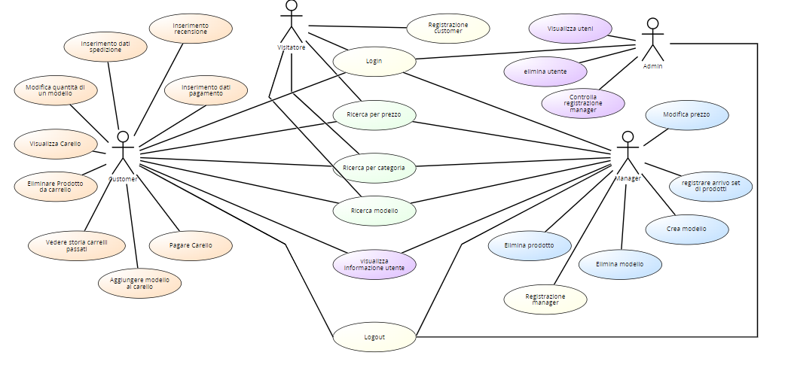

# Requirements Document - future EZElectronics

Date:

Version: V1 - description of EZElectronics in FUTURE form (as proposed by the team)

| Version number | Change |
| :------------: | :----: |
|         2       |        |

# Contents

- [Requirements Document - future EZElectronics](#requirements-document---future-ezelectronics)
- [Contents](#contents)
- [Informal description](#informal-description)
- [Stakeholders](#stakeholders)
- [Context Diagram and interfaces](#context-diagram-and-interfaces)
  - [Context Diagram](#context-diagram)
  - [Interfaces](#interfaces)
- [Stories and personas](#stories-and-personas)
- [Functional and non functional requirements](#functional-and-non-functional-requirements)
  - [Functional Requirements](#functional-requirements)
  - [Non Functional Requirements](#non-functional-requirements)
- [Use case diagram and use cases](#use-case-diagram-and-use-cases)
  - [Use case diagram](#use-case-diagram)
    - [Use case 1, UC1](#use-case-1-uc1)
      - [Scenario 1.1](#scenario-11)
      - [Scenario 1.2](#scenario-12)
      - [Scenario 1.x](#scenario-1x)
    - [Use case 2, UC2](#use-case-2-uc2)
    - [Use case x, UCx](#use-case-x-ucx)
- [Glossary](#glossary)
- [System Design](#system-design)
- [Deployment Diagram](#deployment-diagram)

# Informal description

EZElectronics (read EaSy Electronics) is a software application designed to help managers of electronics stores to manage their products and offer them to customers through a dedicated website. Managers can assess the available products, record new ones, and confirm purchases. Customers can see available products, add them to a cart and see the history of their past purchases.

# Stakeholders

| Stakeholder name | Description |
| :--------------: | :---------: |
| Manager  |    Responsabile della gestione dei propri prodotti         |
| Customer | Cliente che utilizza il sito per acquistare prodotti |
| Admin | Responsabile del sito e dei profili degli utenti |
| Visitatore| Utente che visita il sito senza registrarsi|
| Servizio pagamento | Fornitori di servizi di pagamento online |
| Servizio spedizione | Fornitori del servizio di spedizione dei prodotti |
| Servizio recensioni | Servizio per inserire un giudizio da parte dei Customer per i prodotti acquistati |

# Context Diagram and interfaces

## Context Diagram

## Interfaces

|   Actor   | Logical Interface | Physical Interface |
| :-------: | :---------------: | :----------------: |
| Customer |        GUI           |   Smartphone/PC                 |
| Admin  | GUI(tutte le funzionalità) | PC|
| Servizio pagamento  | www.satispay, paypal..| Internet|
| Servizio recensioni  | business.google/reviews | Internet |
| Servizio spedizioni | GLS, Bartolini| Internet |

# Stories and personas

### CUSTOMER
<b>Persona 1</b>
John, cliente abituale del negozio online, tecnologicamente competente e appassionato di nuove tecnologie. Desidera un'esperienza di shopping online veloce e conveniente.

<b>Storia</b>
John desidera acquistare un nuovo smartphone. Accede al negozio online, naviga tra i prodotti, aggiunge lo smartphone al carrello, effettua il checkout e completa il pagamento utilizzando la sua carta di credito. Sucessivamente, decide di inserire una recensione positiva per il prodotto acquistato dovuto all'efficienza nella spedizione e alla qualità del prodotto.

### MANAGER

<b>Persona 2</b>
Alice, manager del negozio online, responsabile delle operazioni quotidiane, della gestione del catalogo prodotti e degli acquisti. Deve garantire che i nuovi prodotti vengano aggiunti correttamente al negozio online e vengano spediti tramite corriere all'indirizzo corretto.

<b>Storia</b>
Alice riceve una notifica sull'avvenuto acquisto di nuovo prodotto. Contatta il corriere più adeguato alla spedizione fornendo informazioni necessarie. Ottiene la data stimata dell'arrivo del prodotto acquistato e lo comunica al cliente tramite il sito stesso.

### ADMIN

<b>Persona 3</b>
Marco, admin del sito si occupa della gestione e del coretto funzionamento del sito stesso. Provvede a gestire tutti gli utenti iscritti, si occupa di cottrollare l'adeguatezza delle recensioni inserite e gestisce la manutenzione del sito.

<b>Storia</b>
Marco riceve una notifica di Alice per registrarsi al sito come manager. Marco prima di procedere alla creazione del suo profilo, controlla e valuta che tutte le informazione da lei inserite siano veritiere.

# Functional and non functional requirements

## Functional Requirements

|  ID   | Description |
| :---: | :---------: |
|  <b>FR1</b>  |    <i>Gestione dei prodotti </i>         |
|  FR1.1  |  Creazione modello           |
| FR1.2 |   Modifica prezzo modello     |
| FR1.3 | Registrazione arrivo di un set di prodotti di uno stesso modello|  
|FR1.4| Visualizzazione tutti prodotti per modello|
| FR1.5| Eliminazione prodotto|
| FR1.6| Eliminazione modello|
| <b>FR2</b> |  <i>Ricerca dei prodotti</i>|
| FR2.1| Filtro per categoria|
| FR2.2| Filtro per modello|
| FR2.3| Filtro per prezzo|
|<b>FR3</b> | <i>Gestione del carrello</i> |
|FR3.1 | Visualizzazione carrello|
| FR3.2 | Aggiunta modello al carrello |
| FR3.3| Rimozione modello dal carrello |
| FR3.4| Pagamento del totale del carrello |
| FR3.5 | Visualizzazione degli acquisti passati |
| FR3.6 | Eliminazione carrello |
| FR3.7 | Modifica quantità modello |
|<b>FR4</b> |<i>Autenticazione</i> |
|FR4.1 | Creazione account con ruolo manager|
|FR4.2 |Creazione account con ruolo customer |
|FR4.3 |Login |
|FR4.3 |Logout |
|FR4.4 |Visualizzazione informazioni utente |
| <b>FR6</b>| <i>Gestione pagamenti</i> |
| FR6.1 | Inserimento dati pagamento |
| <b>FR7</b>| <i>Gestione spedizione</i> |
| FR7.1 | Inserimento dati spedizione ||
| <b>FR8</b>| <i>Gestione recensioni</i> |
| FR8.1 | Inserimento recensione|
| <b>FR9</b>| <i>Ricerca recensioni</i> |
| FR9.1 | Ricerca per modello |
| <b>FR10</b>| <i>  Gestione sito </i> |
| FR10.1 | Visualizza utenti |
| FR10.2 | Controlla registrazione manager |
| FR10.3 | Elimina utenti |

## Access rights

|  Function   | Customer | Visitator| Manager|Admin|
| :---: | :---------: | :---: | :---------: |:----: |
|  Creazione modello | | | x | |
|   Modifica prezzo modello | | |x | |
| Registrazione arrivo di un set di prodotti di uno stesso modello| | | x| |
| Visualizzazione tutti prodotti per modello| | | x| |
| Eliminazione prodotto| | |x | |
| Eliminazione modello| | |x | |
|  Filtro per categoria| x|x |x  | |
|  Filtro per modello| x| x| x | |
|  Filtro per prezzo| x|x |x | |
| Visualizzazione carrello| x| | | |
| Aggiunta modello al carrello |x | | | |
| Rimozione modello dal carrello |x | | | |
|  Pagamento del totale del carrello |x | | | |
|  Visualizzazione degli acquisti passati |x | | | |
|  Eliminazione carrello |x | | | |
|  Modifica quantità modello | | |x | |
| Creazione account con ruolo manager| | |x| |
|Creazione account con ruolo customer | x| | | |
|Login | x| |x | | |
|Logout | x| | x| | |
| Visualizzazione informazione account| x| |x | |
| Inserimento dati pagamento |x | | | |
| Inserimento dati spedizione |x | | | |
|  Inserimento recensione| x| | | |
| Ricerca per modello (recensioni)|x |x | | |
| Visualizza utenti | | | |x|
| Controlla registrazione manager | | | |x|
| Elimina utenti | | | |x|

## Non Functional Requirements

|   ID    | Type (efficiency, reliability, ..) | Description | Refers to |
| :-----: | :--------------------------------: | :---------: | :-------: |
|  NFR1   |  Usabilità                                  |   No training          |   C/M        |
|  NFR2   |    Efficenza                                |   Tempi di risposta <0.5 sec (escludendo la rete)          |   C/M        |
|  NFR3   |    Affidabilità                                |     Recupero dei Dati in caso di guasto o perdita di connessione        |     C/M      |
|NFR4  |                                    |    Zero errori di mancata soedizione di un prodotto       |    C/M       |
|NFR5| Security| Massimo numero di errori nel prezzo < 1 anno |C/M|
|NFR6| | nessun problema o perdita di dati di pagamento  |C/M|
|NFR7| Portabilità |Supporto multidispositivo |C/M|
|NFR8| | Compatibilità dei browser (Chrome, Firewall, Opera, Safari..) |C/M|

# Use case diagram and use cases

## Use case diagram

### Use case 1, UC1

| Actors Involved  | User                                                                     |
| :--------------: | :------------------------------------------------------------------:     |
|   Precondition   | L'Utente non ha un account                                               |
|  Post condition  | Utente registrato                                                        |
| Nominal Scenario | Scenario 1.1                                                             |
|     Variants     | Scenario 1.2                                                                      |
|    Exceptions    | Scenario 1.3, 1.4                                                             |

##### Scenario 1.1

|  Scenario 1.1  | Registrazione customer                                                         |
| :------------: | :------------------------------------------------------------------------: |
|  Precondition  | Il customer non ha account                                                      |
| Post condition | Customer Registrato                                                            |
|     Step#      |                                Description                                 |
|       1        | Customer: chiede di registrarsi                                                |
|       2        | Sistema: chiede nome, cognome, username, password, ruolo                   |
|       3        | Customer: inserisce nome, cognome, username, password, ruolo                   |
|       4        | Sistema: legge nome, cognome, username, password, ruolo                    |
|       5        | Sistema: controlla che username non sia già associato a un altro account   |
|       6        | Sistema: crea il nuovo account per il customer e inserisce le sue informazioni nel database |

##### Scenario 1.2

|  Scenario 1.2  | Registrazione manager                                                         |
| :------------: | :------------------------------------------------------------------------: |
|  Precondition  | Il manager non ha account                                                      |
| Post condition | Manager Registrato                                                            |
|     Step#      |                                Description                                 |
|       1        | Manager: chiede di registrarsi                                                |
|       2        | Sistema: chiede nome, cognome, username, password, ruolo                   |
|       3        | Manager: inserisce nome, cognome, username, password, ruolo                   |
|       4        | Sistema: legge nome, cognome, username, password, ruolo                    |
|       5        | Sistema: controlla che username non sia già associato a un altro account   |
|       6       | Sistema: chiede indirizzo del negozio del manager, P.IVA e dati relativi al negozio   |
|       7        | Manager: inserisce le informazioni richieste   |
|       8        | Sistema: salva le informazioni dategli dal manager in attesa di convalida da parte dell'admin   |
|       9        | Admin: controlla che le informazioni inserite dal manager siano valide e chiede al sistema di salvarle   |
|       10        | Sistema: crea il nuovo account per il manager e inserisce le sue informazioni nel database |

##### Scenario 1.3

|  Scenario 1.3  | Utente già registrato                                                      |
| :------------: | :------------------------------------------------------------------------: |
|  Precondition  | L'Utente ha un account                                                     |
| Post condition | Registrazione fallita                                                      |
|     Step#      |                                Description                                 |
|       1        | User: chiede di registrarsi                                                |
|       2        | Sistema: chiede nome, cognome, username, password, ruolo                   |
|       3        | User: inserisce nome, cognome, username, password, ruolo                   |
|       4        | Sistema: legge nome, cognome, username, password, ruolo                    |
|       5        | Sistema: controlla che username non sia già associato a un altro account. Username è già stata usata e invia un messaggio di errore   |

##### Scenario 1.4

|  Scenario 1.4 | Manager inserisce informazioni sbagliate                                            |
| :------------: | :------------------------------------------------------------------------: |
|  Precondition  | Il manager non ha account                                                      |
| Post condition | Manager Registrato                                                            |
|     Step#      |                                Description                                 |
|       1        | Manager: chiede di registrarsi                                                |
|       2        | Sistema: chiede nome, cognome, username, password, ruolo                   |
|       3        | Manager: inserisce nome, cognome, username, password, ruolo                   |
|       4        | Sistema: legge nome, cognome, username, password, ruolo                    |
|       5        | Sistema: controlla che username non sia già associato a un altro account   |
|       6       | Sistema: chiede indirizzo del negozio del manager, P.IVA e dati relativi al negozio   |
|       7        | Manager: inserisce le informazioni richieste   |
|       8        | Sistema: salva le informazioni dategli dal manager in attesa di convalida da parte dell'admin   |
|       9        | Admin: controlla che le informazioni inserite dal manager siano valide ma nota incongruenze e chiede al sistema di inviare un messaggi o di errore   |
|       10        | Sistema: invia messaggio di errore  |

### Use case 2, UC2

| Actors Involved  | User/Manager                                                             |
| :--------------: | :------------------------------------------------------------------:     |
|   Precondition   | User/Manager non loggato ma registrato                                   |
|  Post condition  | User/Manager loggato                                                     |
| Nominal Scenario | Scenario 2.1                                                             |
|     Variants     |             /                                                             |
|    Exceptions    | Scenario 2.2, 2.3                                                        |

##### Scenario 2.1

|  Scenario 2.1  | Login                                                                      |
| :------------: | :------------------------------------------------------------------------: |
|  Precondition  | User/Manager non loggato ma registrato                                     |
| Post condition | User/Manager loggato                                                       |
|     Step#      |                                Description                                 |
|       1        | Sistema: chiede username e password                                        |
|       2        | User/Manager: inserisce username e password                                |
|       3        | Sistema: legge username e password e controlla che l’utente non sia già loggato |
|       4        | Sistema: controlla che la password coincida con quella fornita al momento della registrazione. La password coincide, l’utente è loggato                 |

##### Scenario 2.2

|  Scenario 2.2  | Password sbagliata                                                         |
| :------------: | :------------------------------------------------------------------------: |
|  Precondition  | User/Manager non loggato ma registrato                                     |
| Post condition | User/Manager non loggato                                                   |
|     Step#      |                                Description                                 |
|       1        | Sistema: chiede username e password                                        |
|       2        | User/Manager: inserisce username e password                                |
|       3        | Sistema: legge username e password e controlla che l’utente non sia già loggato |
|       4        | Sistema: controlla che la password coincida con quella fornita al momento della registrazione. La password non coincide, l’utente non viene autorizzato |

##### Scenario 2.3

|  Scenario 2.3  |  Utente non registrato                                                     |
| :------------: | :------------------------------------------------------------------------: |
|  Precondition  | User/Manager non loggato e non registrato                                  |
| Post condition | User/Manager non loggato                                                   |
|     Step#      |                                Description                                 |
|       1        | Sistema: chiede username e password                                        |
|       2        | User/Manager: inserisce username e password                                |
|       3        | Sistema: legge username e password e controlla che l’utente non sia già loggato |
|       4        | Sistema: cerca l’username fornito nel database per confrontare la password ma non trova l’username. L’utente non viene autorizzato |

### Use case 3, UC3

| Actors Involved  | User/Manager                                                             |
| :--------------: | :------------------------------------------------------------------:     |
|   Precondition   | User/Manager loggato                                                     |
|  Post condition  | User/Manager non loggato                                                 |
| Nominal Scenario | Scenario 3.1                                                             |
|     Variants     |                                                                          |
|    Exceptions    | Scenario 3.2                                                             |

##### Scenario 3.1

|  Scenario 3.1  | Logout                                                                     |
| :------------: | :------------------------------------------------------------------------: |
|  Precondition  | Utente loggato                                                             |
| Post condition | Utente non loggato                                                         |
|     Step#      |                                Description                                 |
|       1        | Utente: richiesta logout                                                   |
|       2        | Sistema: ricerca utente, ricerca cockie                                    |
|       3        | Sistema: rimuove autorizzazione utente loggato                             |
|       4        | Sistema: mostra un messaggio di conferma                                   |

##### Scenario 3.2

|  Scenario 3.2  | Utente ha già fatto logout                                                 |
| :------------: | :------------------------------------------------------------------------: |
|  Precondition  | Utente non loggato                                                         |
| Post condition | Utente non loggato                                                         |
|     Step#      |                                Description                                 |
|       1        | Utente: richiesta logout                                                   |
|       2        | Sistema: ricerca utente, ricerca cockie                                    |
|       3        | Sistema: trova che l’utente non è loggato                                  |
|       4        | Sistema: mostra un messaggio di errore                                     |

### Use case 4, UC4

| Actors Involved  | Manager                                                                  |
| :--------------: | :------------------------------------------------------------------:     |
|   Precondition   | Manager loggato                                                          |
|  Post condition  | Creazione Modello                                                       |
| Nominal Scenario |   Scenario 4.1                                                                    |
|     Variants     |   Scenario 4.2, 4.3                                                         |
|    Exceptions    |    Scenario  4.4, 4.5, 4.6                                          |

##### Scenario 4.1

|  Scenario 4.1  | Creazione Modello con Arrival time                                        |
| :------------: | :------------------------------------------------------------------------: |
|  Precondition  | Manager loggato                                                            |
| Post condition | Nuovo modello creato                                                      |
|     Step#      |                                Description                                 |
|       1        | Manager: Richiesta di creare un nuovo modello                             |
|       2        | Sistema: Chiede sellingPrice, model, category(Smartphone, Laptop, Appliance), details (can be empty), ArrivalDate (optional)                                                                        |
|       3        | Manager: Inserisce campi                                                   |
|       4        | Sistema: Controlla se il modello è già esistente nel database, che data aggiunta modello non sia dopo la data corrente e che non siano vuoti campi obbligatori                                         |
|       5        | Sistema: Crea nuovo modello  con un solo prodotto                                             |

##### Scenario 4.2

|  Scenario 4.2  | Creazione modello senza Arrival time                                      |
| :------------: | :------------------------------------------------------------------------: |
|  Precondition  | Manager loggato                                                            |
| Post condition | Nuovo modello creato                                                      |
|     Step#      |                                Description                                 |
|       1        | Manager: Richiesta di creare un nuovo modello                             |
|       2        | Sistema: Chiede sellingPrice, model, category(Smartphone, Laptop, Appliance), details (can be empty), ArrivalDate (optional)                                                                        |
|       3        | Manager: Inserisce campi ma lascia vuoto ArrivalDate                       |
|       4        | Sistema: Controlla se il modello è già esistente nel database, che data aggiunta modello non sia dopo la data corrente e che non siano vuoti campi obbligatori                                         |
|       5        | Sistema: Inserisce in automatico Arrival Data = Current Data               |
|       6        | Sistema: Crea nuovo modello con un solo prodotto                                           |

##### Scenario 4.3

|  Scenario 4.3  | Creazione modello con campo vuoto                                         |
| :------------: | :------------------------------------------------------------------------: |
|  Precondition  | Manager loggato                                                            |
| Post condition | Nuovo modello creato                                                      |
|     Step#      |                                Description                                 |
|       1        | Manager: Richiesta di creare un nuovo modello                             |
|       2        | Sistema: Chiede  sellingPrice, model, category(Smartphone, Laptop, Appliance), details (can be empty), ArrivalDate (optional)                                                                        |
|       3        | Manager: Inserisce campi                                                   |
|       4        | Sistema: Controlla se il omodello tto è già esistente nel database, che data aggiunta modello non sia dopo la data corrente e che non siano vuoti campi obbligatori                                         |
|       5        | Sistema: Crea nuovo modello con un solo prodotto                                               |

##### Scenario 4.4

|  Scenario 4.4  | Creazione modello con campo obbligatorio vuoto                            |
| :------------: | :------------------------------------------------------------------------: |
|  Precondition  | Manager loggato                                                            |
| Post condition | Nuovo modello non creato                                                  |
|     Step#      |                                Description                                 |
|       1        | Manager: Richiesta di creare un nuovo modello                             |
|       2        | Sistema: Chiede  sellingPrice, model, category(Smartphone, Laptop, Appliance), details (can be empty), ArrivalDate (optional)                                                                        |
|       3        | Manager: Inserisce campi ma lascia vuoto campo obbligatorio                |
|       4        | Sistema: Controlla se il modello è già esistente nel database, che data aggiunta modello non sia dopo la data corrente e che non siano vuoti campi obbligatori                                         |
|       5        | Sistema: Chiede di inserire campi obbligatori                              |

##### Scenario 4.5

|  Scenario 4.5  | Creazione modello con modello esiste nel database                 |
| :------------: | :------------------------------------------------------------------------: |
|  Precondition  | Il manager è loggato                                                       |
| Post condition | modello non aggiunto                                                      |
|     Step#      |                                Description                                 |
|       1        | Manager: chiede di aggiungere un modello                                  |
|       2        | Sistema: chiede prezzo, modello (uno tra Smartphone, Laptop, Apparecchio), categoria, dettagli (può essere vuota), giorno di arrivo (se assente viene inserita in automatico data corrente)       |
|       3        | Manager: inserisce campi                                                   |
|       4        | Sistema: controlla se il modello è già esistente nel database e controlla che data aggiunta modello non sia dopo la data corrente                                                                         |
|       5        | Sistema: ritorna errore 409                                                |

##### Scenario 4.6

|  Scenario 4.6  | Creazione modello con data aggiunta modello dopo Data corrente           |
| :------------: | :------------------------------------------------------------------------: |
|  Precondition  | Il manager è loggato                                                       |
| Post condition | Modello non aggiunto                                                      |
|     Step#      |                                Description                                 |
|       1        | Manager: chiede di aggiungere un modello                                  |
|       2        | Sistema: chiede  prezzo, modello (uno tra Smartphone, Laptop, Apparecchio), categoria, dettagli (può essere vuota), giorno di arrivo (se assente viene inserita in automatico data corrente)       |
|       3        | Manager: inserisce campi                                                   |
|       4        | Sistema: controlla se il modello è già esistente nel database e controlla che data aggiunta modello non sia dopo la data corrente                                                                         |
|       5        | Sistema: ritorna errore                                                    |

### Use case 5, UC5

| Actors Involved  | Manager                                                                  |
| :--------------: | :------------------------------------------------------------------:     |
|   Precondition   | Manager loggato                                                          |
|  Post condition  | Registrare set di prodotti                                               |
| Nominal Scenario |   Scenario 5.1                                                                    |
|     Variants     | Scenario 5.2  |
|    Exceptions    | Scenario 5.3, 5.4  |

##### Scenario 5.1

|  Scenario 5.1  | Registrare set di Prodotto con Arrival time                                |
| :------------: | :------------------------------------------------------------------------: |
|  Precondition  | Manager loggato                                                            |
| Post condition | Nuovo set di prodotti registrati                                           |
|     Step#      |                                Description                                 |
|       1        | Manager: Richiesta di registrare un set di prodotti                        |
|       2        | Sistema: Chiede sellingPrice, model, category(Smartphone, Laptop, Appliance), details (can be empty), ArrivalDate (optional), quantity                                                              |
|       3        | Manager: Inserisce campi                                                   |
|       4        | Sistema: Controlla che data aggiunta  non sia dopo la data corrente e che non siano vuoti campi obbligatori                                         |
|       5        | Sistema: Registra set di prodotti con codice univico generati automaticamente                                        |

##### Scenario 5.2

|  Scenario 5.2  | Registrare set di prodotti senza Arrival time                              |
| :------------: | :------------------------------------------------------------------------: |
|  Precondition  | Manager loggato                                                            |
| Post condition | Nuovo set di prodotti creato                                                      |
|     Step#      |                                Description                                 |
|       1        | Manager: Richiesta di registrare un set di prodotti                        |
|       2        | Sistema: Chiede sellingPrice, model, category(Smartphone, Laptop, Appliance), details (can be empty), ArrivalDate (optional), quantity                                                              |
|       3        | Manager: Inserisce campi ma lascia vuoto ArrivalDate                       |
|       4        | Sistema: Controlla  che data aggiunta prodotto non sia dopo la data corrente e che non siano vuoti campi obbligatori                                         |
|       5        | Sistema: Inserisce in automatico Arrival Data = Current Data               |
|       6        | Sistema: Registra set di prodotti con codice univoco generato automatiamente                                     |

##### Scenario 5.3

|  Scenario 5.3  | Registrare set di prodotti con campo vuoto                                 |
| :------------: | :------------------------------------------------------------------------: |
|  Precondition  | Manager loggato                                                            |
| Post condition | Nuovo set di prodotti creato                                                      |
|     Step#      |                                Description                                 |
|       1        | Manager: Richiesta di registrare un set di prodotti                        |
|       2        | Sistema: Chiede  sellingPrice, model, category(Smartphone, Laptop, Appliance), details (can be empty), ArrivalDate (optional), quantity                                                              |
|       3        | Manager: Inserisce campi                                                   |
|       4        | Sistema: Controlla  che data aggiunta non sia dopo la data corrente e che non siano vuoti campi obbligatori                                         |
|       5        | Sistema: Registra set di prodotticon codice univoco generato automatiamente                             |

##### Scenario 5.4

|  Scenario 5.4  | Registrare set di prodotti con campo obbligatorio vuoto                    |
| :------------: | :------------------------------------------------------------------------: |
|  Precondition  | Manager loggato                                                            |
| Post condition | Nuovo set di prodotti non creato                                                  |
|     Step#      |                                Description                                 |
|       1        | Manager: Richiesta di registrare un set di prodotti                        |
|       2        | Sistema: Chiede sellingPrice, model, category(Smartphone, Laptop, Appliance), details (can be empty), ArrivalDate (optional), quantity                                                              |
|       3        | Manager: Inserisce campi ma lascia vuoto campo obbligatorio                |
|       4        | Sistema: Controlla  che data aggiunta  non sia dopo la data corrente e che non siano vuoti campi obbligatori                                         |
|       5        | Sistema: Chiede di inserire campi obbligatori                              |

##### Scenario 5.5

|  Scenario 5.5  | Registrare set di prodotti con data aggiunta prodotto dopo Data corrente   |
| :------------: | :------------------------------------------------------------------------: |
|  Precondition  | Il manager è loggato                                                       |
| Post condition | Prodotto non aggiunto                                                      |
|     Step#      |                                Description                                 |
|       1        | Manager: Richiesta di registrare un set di prodotti                        |
|       2        | Sistema: Chiede code, sellingPrice, model, category(Smartphone, Laptop, Appliance), details (can be empty), ArrivalDate (optional), quantity                                                              |
|       3        | Manager: inserisce campi                                                   |
|       4        | Sistema: controlla se il prodotto è già esistente nel database e controlla che data aggiunta prodotto non sia dopo la data corrente                                                                         |
|       5        | Sistema: ritorna errore                                                    |
### Use case 6, UC6
| Actors Involved  | User                                                                     |
| :--------------: | :------------------------------------------------------------------:     |
|   Precondition   | Manager loggato                                                           |
|  Post condition  | Modifica prezzo                                                 |
| Nominal Scenario | Scenario 6.1                                                             |
|     Variants     |                                                           |
|    Exceptions    |       Scenario 6.2                                                                      |

##### Scenario 6.1

|  Scenario 5.6  | Modifica prezzo    |
| :------------: | :------------------------------------------------------------------------: |
|  Precondition  | Il manager è loggato                                                       |
| Post condition | Prezzo modificato                                                     |
|     Step#      |                                Description                                 |
|       1        | Manager: entra nella visualizzazione prodotti, seleziona prodotto e richiede di cambiare prezzo                        |
|       2        | Sistema: Chiede il nuovo prezzo da inserire                                                          |
|       3        | Manager: inserisce prezzo                                                   |
|       4        | Sistema: modifica prezzo                                                    |

### Use case 7, UC7

| Actors Involved  | User                                                                     |
| :--------------: | :------------------------------------------------------------------:     |
|   Precondition   | --                                                          |
|  Post condition  | Visualizzazione prodotti                                                 |
| Nominal Scenario | Scenario 7.1                                                             |
|     Variants     | Scenario 7.2                                                             |
|    Exceptions    |                                                                          |

##### Scenario 7.1

|  Scenario 7.1  | Visualizza tutti i modelli                                                 |
| :------------: | :------------------------------------------------------------------------: |
|  Precondition  |                                                            |
| Post condition | Mostra tutti i modelli                                                    |
|     Step#      |                                Description                                 |
|       1        | Utente: chiede la visualizzazione di tutti i modelli                      |
|       2        | Sistema: recupera tutti i prodotti e li mostra                             |

##### Scenario 7.2

|  Scenario 7.2 | Visualizza tutti i prodotti per modello                                             |
| :------------: | :------------------------------------------------------------------------: |
|  Precondition  | Manager loggato                                                             |
| Post condition | Mostra tutti i prodotti per ogni modello                                                    |
|     Step#      |                                Description                                 |
|       1        | Manager: entra nella visualizzazione modelli, seleziona modello e chiede la visualizzazione di tutti i prodotti per quel modello                      |
|       2        | Sistema: recupera tutti i prodotti e li mostra                             |

##### Scenario 7.3

|  Scenario 7.3  | Visualizza tutti i propri prodotti venduti per modello                                        |
| :------------: | :------------------------------------------------------------------------: |
|  Precondition  | Manager loggato                                                             |
| Post condition | Mostra tutti i propri prodotti venduti                                            |
|     Step#      |                                Description                                 |
|       1        | Manager: chiede la visualizzazione di tutti i propri prodotti venduti (sold = yes) |
|       2        | Sistema: recupera tutti i prodotti venduti del manager e li mostra con informazioni specifiche del prodotto                    |

##### Scenario 7.4

|  Scenario 7.4  | Visualizza tutti i propri prodotti non venduti per modello                                    |
| :------------: | :------------------------------------------------------------------------: |
|  Precondition  | Manager loggato                                                             |
| Post condition | Mostra tutti i propri prodotti non venduti                                        |
|     Step#      |                                Description                                 |
|       1        | Manager: chiede la visualizzazione di tutti i propri prodotti non venduti (sold = no)|
|       2        | Sistema: recupera tutti i prodotti non venduti del manager e li mostra con informazioni specifiche del prodotto                |

##### Scenario 7.5

|  Scenario 7.5  | Ricerca per categoria                                                      |
| :------------: | :------------------------------------------------------------------------: |
|  Precondition  |                                                             |
| Post condition | Mostra modelli per categoria                                              |
|     Step#      |                                Description                                 |
|       1        | Utente: inserisce la categoria da mostare                                  |
|       2        | Sistema: controlla l'esistenza della categoria (Smartphone, Laptop, Appliance)|
|       3        | Sistema: mostra i modelli  appartenti a quella categoria                   |

##### Scenario 7.6

|  Scenario 7.6  | Ricerca modello                                                        |
| :------------: | :------------------------------------------------------------------------: |
|  Precondition  |                                                              |
| Post condition | Mostra modello                                                |
|     Step#      |                                Description                                 |
|       1        | Utente: inserisce il modello da mostare                                    |
|       2        | Sistema: controlla l'esistenza del modello                                 |
|       3        | Sistema: mostra  modello                                |

##### Scenario 7.7

|  Scenario 7.7  | Ricerca per prezzo                                                        |
| :------------: | :------------------------------------------------------------------------: |
|  Precondition  |                                                             |
| Post condition | Mostra prodotti per prezzo                                                |
|     Step#      |                                Description                                 |
|       1        | Utente: inserisce la fascia di prezzo dei modelli da mostare                                    |
|       2        | Sistema: controlla l'esistenza di modelli in quella fascia di prezzo                                 |
|       3        | Sistema: mostra i modelli che rientrano nella fascia di prezzo inserita                                |

### Use case 8, UC8

| Actors Involved  | Manager                                                                  |
| :--------------: | :------------------------------------------------------------------:     |
|   Precondition   | Manager loggato                                                          |
|  Post condition  | Eliminare Prodotto                                                       |
| Nominal Scenario | Scenario 8.1                                                                      |
|     Variants     |                                                                          |
|    Exceptions    |                                                                      |

##### Scenario 8.1

|  Scenario 8.1  | Eliminare prodotto                                                         |
| :------------: | :------------------------------------------------------------------------: |
|  Precondition  | Manager loggato                                                            |
| Post condition | Prodotto eliminato                                                         |
|     Step#      |                                Description                                 |
|       1        | Manager: entra nella visualizzazione prodotti e seleziona il prodotto di interesse                      |                  |
|       2        | Manager: richiede di eliminare il prodotto selezionato |
|       3        | Sistema: elimina prodotto e aggiorna i prodotti disponibili per modello                                               |

##### Scenario 8.2

|  Scenario 8.2  | Eliminare modello                                                        |
| :------------: | :------------------------------------------------------------------------: |
|  Precondition  | Manager loggato                                                            |
| Post condition | Modello eliminato                                                         |
|     Step#      |                                Description                                 |
|       1        | Manager: entra nella visualizzazione modelli e seleziona il modello di interesse                      |                  |
|       2        | Manager: richiede di eliminare il modello selezionato |
|       3        | Sistema: elimina prodotto                                                  |

### Use case 9, UC9

| Actors Involved  | Customer                                                            |
| :--------------: | :------------------------------------------------------------------:     |
|   Precondition   | Il Customer è loggato                                                 |
|  Post condition  | Visualizzazione carrello        |
| Nominal Scenario | Scenario 9.1                                                             |
|     Variants     |                                                                          |
|    Exceptions    |                                                                          |

##### Scenario 9.1

|  Scenario 9.1  | Visualizzazione carrello                                                     |
| :------------: | :------------------------------------------------------------------------: |
|  Precondition  | Customer loggato                                                                         |
| Post condition | Carrello visualizzato                                                       |
|     Step#      |                                Description                                 |
|       1        | Customer: chiede di visualizzare il carrello                                            |
|       2        | Sistema: restituisce il carrello del Customer loggato                           |

### Use case 10, UC10

| Actors Involved  | Customer                                                            |
| :--------------: | :------------------------------------------------------------------:     |
|   Precondition   | Il Customer è loggato                                                 |
|  Post condition  | Aggiungere prodotto al carrello        |
| Nominal Scenario | Scenario 10.1                                                             |
|     Variants     |                                                                          |
|    Exceptions    | Scenario 10.2, 10.3, 10.4                                                                   |

##### Scenario 10.1

|  Scenario 10.1  | Aggiungere modello al carrello                                                     |
| :------------: | :------------------------------------------------------------------------: |
|  Precondition  | Customer loggato                                                                         |
| Post condition | Modello aggiunto al carrello                                                      |
|     Step#      |                                Description                                 |
|       1        | Customer: entra nella visualizzazione dei modelli chiede di aggiungere prodotti dello stesso modello al carrello                                            |
|       2        | Sistema: richiede quantità dei prodotti da aggiungere                          |
|       3        | Customer: inserisce quantità                                           |
|       4        | Sistema: aggiunge al carrello   

##### Scenario 10.2

|  Scenario 10.2  | Modello esaurito                                              |
| :------------: | :------------------------------------------------------------------------: |
|  Precondition  | Customer loggato                                                                         |
| Post condition | Errore                                                    |
|     Step#      |                                Description                                 |
|       1        | Customer: entra nella visualizzazione dei modelli chiede di aggiungere prodotti dello stesso modello al carrello                                            |
|       2        | Sistema: richiede quantità dei prodotti da aggiungere                          |
|       3        | Customer: inserisce quantità                                           |
|       4        | Sistema: restituisce errore perché prodotto esaurito |

### Use case 11, UC11

| Actors Involved  | Customer                                                            |
| :--------------: | :------------------------------------------------------------------:     |
|   Precondition   | Il Customer è loggato                                                 
|
|  Post condition  | Pagamento carrello        |
| Nominal Scenario | Scenario 11.1                                                             |
|     Variants     |                                                                          |
|    Exceptions    | Scenario 11.2, 11.3                                                                  |

##### Scenario 11.1

|  Scenario 11.1  | Pagamento carrello                                                     |
| :------------: | :------------------------------------------------------------------------: |
|  Precondition  | Customer loggato                                                                         |
| Post condition | Carrello pagato                                                      |
|     Step#      |                                Description                                 |
|       1        | Customer: chiede di effettuare pagamento dei prodotti nel carrello                                            |
|       2        | Sistema: mostra totale da pagare                           |
|       3        | Customer: effettua pagamento                                           |
|       4        | Sistema: conferma pagamento e PaymentDate = CurrentDate e aggiorna la quantità dei prodotti disponibili memorizzando ciascuna SellingDate                        |
| 5 | Sistema: mostra le informazioni relative alla consegna ricevute dal corriere |

##### Scenario 11.2

|  Scenario 11.2  | Carrello inesistente                                                     |
| :------------: | :------------------------------------------------------------------------: |
|  Precondition  | Customer loggato                                                                         |
| Post condition | Errore 404                                                     |
|     Step#      |                                Description                                 |
|       1        | Customer: chiede di effettuare pagamento dei prodotti nel carrello                                            |
|       2        | Sistema: restituisce errore 404 perché carrello inesistente                          |

##### Scenario 11.3

|  Scenario 11.3  | Carrello vuoto                                                    |
| :------------: | :------------------------------------------------------------------------: |
|  Precondition  | Customer loggato                                                                         |
| Post condition | Errore 404                                                      |
|     Step#      |                                Description                                 |
|       1        | Customer: chiede di effettuare pagamento dei prodotti nel carrello                                            |
|       2        | Sistema: restituisce errore 404 perché carrello vuoto                       |

### Use case 12, UC12

| Actors Involved  | Customer                                                            |
| :--------------: | :------------------------------------------------------------------:     |
|   Precondition   | Il Customer è loggato                                                 |
|  Post condition  | Visualizzazione cronologia carrelli pagati       |
| Nominal Scenario | Scenario 12.1                                                             |
|     Variants     |                                                                          |
|    Exceptions    |                                                                        |

##### Scenario 12.1

|  Scenario 12.1  | Visualizzazione cronologia carrelli                                                     |
| :------------: | :------------------------------------------------------------------------: |
|  Precondition  | Customer loggato                                                                         |
| Post condition | Visualizzazione cronologia dei carrelli pagati                                                     |
|     Step#      |                                Description                                 |
|       1        | Customer: chiede di visualizzare la cronologia dei carrelli pagati                                            |
|       2        | Sistema: mostra cronologia dei carrelli pagati dal Customer loggato                         |

### Use case 13, UC13

| Actors Involved  | Customer                                                                     |
| :--------------: | :------------------------------------------------------------------:     	  |
|   Precondition   | Customer loggato in visualizzazione carello                                                            |
|  Post condition  | Rimuove prodotto dal carello                                                 |
| Nominal Scenario | Scenario 13.1                                              		  |
|     Variants     |                                                                          	  |
|    Exceptions    | Scenario 13.2                                              |

##### Scenario 13.1

|  Scenario 13.1 | Rimuovi prodotto dal carrello                                                  |
| :------------: | :------------------------------------------------------------------------:     |
|  Precondition  | Customer loggato                                                               |
| Post condition | Rimuovi prodotto dal carello                                                   |
|     Step#      |                                Description                                     |
|       1        | Customer: visualizza il carello, seleziona il prodotto e richiede di rimuoverlo                         |
|       2        | Sistema: rimuove prodotto dal carello                                          |

##### Scenario 13.2

|  Scenario 13.5 | Modello esaurito                                                               |
| :------------: | :------------------------------------------------------------------------:     |
|  Precondition  | Customer loggato                                                               |
| Post condition | Errore 409                                                                     |
|     Step#      |                                Description                                     |
|       1        | Customer: visualizza il carello, seleziona il prodotto e richiede di rimuoverlo|
|       4        | Sistema: ritorna errore 409 perché il prodotto è già stato venduto             |

### Use case 14, UC14

| Actors Involved  | Customer                                                            |
| :--------------: | :------------------------------------------------------------------:     |
|   Precondition   | Il Customer è loggato                                                 |
|  Post condition  | Eliminazione carrello      |
| Nominal Scenario | Scenario 14.1                                                             |
|     Variants     |                                                                          |
|    Exceptions    | Scenario 14.2                                                           |

##### Scenario 14.1

|  Scenario 14.1  | Elminazione carrello                                                     |
| :------------: | :------------------------------------------------------------------------: |
|  Precondition  | Customer loggato                                                                         |
| Post condition | Carrello eliminato                                                    |
|     Step#      |                                Description                                 |
|       1        | Customer: chiede di eliminare il carrello                                            |
|       2        | Sistema: elimina il carrello del Customer loggato                        |

##### Scenario 14.2

|  Scenario 14.2  | Carrello inesistente                                                   |
| :------------: | :------------------------------------------------------------------------: |
|  Precondition  | Customer loggato                                                                         |
| Post condition | Errore 404                                                    |
|     Step#      |                                Description                                 |
|       1        | Customer: chiede di eliminare il carrello                                            |
|       2        | Sistema: restituisce errore 404 perché non esiste un carrello per il Customer loggato                        |

### Use case 15, UC15

| Actors Involved  | Customer                                                                     |
| :--------------: | :------------------------------------------------------------------:     	  |
|   Precondition   | Customer loggato in visualizzazione carello                                  |
|  Post condition  | Cambia quantità                                                              |
| Nominal Scenario | Scenario 15.1                                              		              |
|     Variants     |                                                                          	  |
|    Exceptions    | Scenario 15.2                                                                |

##### Scenario 15.1

|  Scenario 13.1 | Modifica quantità                                                              |
| :------------: | :------------------------------------------------------------------------:     |
|  Precondition  | Customer loggato                                                               |
| Post condition | Cambia quantità                                                                |
|     Step#      |                                Description                                     |
|       1        | Customer: visualizza il carello, seleziona il prodotto e richiede di cambiare la quantità inserendola |
|       2        | Sistema: modifica quantità inserita nel carello                                |

##### Scenario 15.2

|  Scenario 15.2 | Modifica quantità non riuscita                                                 |
| :------------: | :------------------------------------------------------------------------:     |
|  Precondition  | Customer loggato                                                               |
| Post condition |                                                                                |
|     Step#      |                                Description                                     |
|       1        | Customer: visualizza il carello, seleziona il prodotto e richiede di cambiare la quantità inserendola |
|       2        | Sistema: mostra messaggio di errore perchè non abbastanza prodotti disponibili |

### Use case 16, UC16

| Actors Involved  | Customer                                                                     |
| :--------------: | :------------------------------------------------------------------:         |
|   Precondition   | Il Customer è loggato                                                        |
|  Post condition  | Dati spedizione inseriti                                                     |
| Nominal Scenario | Scenario 16.1                                                                |
|     Variants     |                                                                              |
|    Exceptions    | Scenario 16.2                                                                |

##### Scenario 16.1

|  Scenario 16.1  | Inserimento dati spedizione                                          |
| :------------: | :------------------------------------------------------------------------: |
|  Precondition  | Customer loggato                                                                         |
| Post condition | Dati di spedizione inseriti                                         |
|     Step#      |                                Description                                 |
|       1        | Sistema: chiede al customer di inserire i dati di spedizione necessari                           |
|       2        | Customer: inserisce i dati richiesti            |
|3| Sistema: legge i dati inseriti e controlla che l'indirizzo inserito sia valido|
|4| Sistema: salva i dati inseriti utili al manager per effettuare la spedizione|

##### Scenario 16.2

|  Scenario 16.2  | Inserimento dati spedizione errati                                   |
| :------------: | :------------------------------------------------------------------------: |
|  Precondition  | Customer loggato                                                                         |
| Post condition | Dati di spedizione inseriti                                         |
|     Step#      |                                Description                                 |
|       1        | Sistema: chiede al customer di inserire i dati di spedizione necessari                           |
|       2        | Customer: inserisce i dati richiesti            |
|3| Sistema: legge i dati inseriti e controlla che l'indirizzo inserito sia valido ma trova un'incongruenza|
|4| Sistema: invia un messaggio di errore|

### Use case 17, UC17

| Actors Involved  | Customer                                                            |
| :--------------: | :------------------------------------------------------------------:     |
|   Precondition   | Il Customer è loggato                                                 |
|  Post condition  |      |
| Nominal Scenario | Scenario 17.1                                                            |
|     Variants     |                                                                         |
|    Exceptions    | Scenario 17.2                                                                    |

##### Scenario 17.1

|  Scenario 17.1  | Gestione del pagamento                                          |
| :------------: | :------------------------------------------------------------------------: |
|  Precondition  | Customer pronto al pagamento del carrello                                                                        |
| Post condition | Pagamento elaborato con successo e ordine confermato |
|     Step#      |                                Description                                 |
|       1        | Customer: seleziona il metodo di pagamento tra le opzioni disponibili                      |
|       2        | Sistema: chiede di inserire le informazioni di pagamento necessarie           |
|3| Customer: inserisce i dati richiesti|
|4| Sistema: verifica se sono corrette le informazioni di pagamento fornite dal customer |
|5|Sistema: le informazioni sono corrette e inoltra la richiesta di pagamento al sistema di pagamento esterno|

##### Scenario 17.2

|  Scenario 17.2  | Pagamento fallito                                |
| :------------: | :------------------------------------------------------------------------: |
|  Precondition  | Customer pronto al pagamento del carrello                                                                        |
| Post condition | Pagamento fallito a causa dei dati inseriti non corretti |
|     Step#      |                                Description                                 |
|       1        | Customer: seleziona il metodo di pagamento tra le opzioni disponibili                      |
|       2        | Sistema: chiede di inserire le informazioni di pagamento necessarie           |
|3| Customer: inserisce i dati richiesti|
|4| Sistema: verifica se sono corrette le informazioni di pagamento fornite dal customer |
|5|Sistema: le informazioni non sono corrette e invia un messaggio di errore|

### Use case 18, UC18

| Actors Involved  | Customer                                                               |
| :--------------: | :------------------------------------------------------------------:     |
|   Precondition   | Customer loggato                                              |
|  Post condition  | Creazione recensione                                                        |
| Nominal Scenario | Scenario 18.1                                                             |
|     Variants     | Scenario 18.2                                                             |
|    Exceptions    | Scenario 18.3                                                            |

##### Scenario 18.1

|  Scenario 18.1  | Creazione recensione                                                         |
| :------------: | :------------------------------------------------------------------------: |
|  Precondition  | Customer loggato                                                      |
| Post condition | Creazione recensione                                                            |
|     Step#      |                                Description                                 |
|       1        | User: richiesta di inserimento recensione                                                |
|       2        | Sistema: chiede  username,  selling date, voto, commento, modello, categoria              |
|       3        | User: inserisce username, selling date, voto, commento, modello, categoria                |
|       4        | Sistema: legge username, selling date, voto, commento, modello, categoria            |
|       5        | Sistema: controlla che i campi obbligatori siano inseriti   |
|       6        | Sistema: crea la nuova recensione in corrispondenza dei dati insieriti e inserisce le sue informazioni nel database |

##### Scenario 18.2

|  Scenario 18.2  | Creazione recensione con alcuni campi vuoti                                                         |
| :------------: | :------------------------------------------------------------------------: |
|  Precondition  | Customer loggato                                                      |
| Post condition | Creazione recensione                                                            |
|     Step#      |                                Description                                 |
|       1        | User: richiesta di inserimento recensione                                                |
|       2        | Sistema: chiede  username, selling date, voto, commento, modello, categoria              |
|       3        | User: inserisce username, selling date, voto, commento               |
|       4        | Sistema: lege username, selling date, voto, commento         |
|       5        | Sistema: controlla che i campi obbligatori siano inseriti   |
|       6        | Sistema: crea la nuova recensione in corrispondenza dei dati insieriti e inserisce le sue informazioni nel database |

##### Scenario 18.3

|  Scenario 18.3  | Creazione recensione con selling date errata                                                     |
| :------------: | :------------------------------------------------------------------------: |
|  Precondition  | Customer loggato                                                      |
| Post condition | Creazione recensione                                                            |
|     Step#      |                                Description                                 |
|       1        | User: richiesta di inserimento recensione                                                |
|       2        | Sistema: chiede  username, selling date, voto, commento, modello, categoria              |
|       3        | User: inserisce username,  selling date, voto, commento, modello, categoria               |
|       4        | Sistema: lege username,  selling date, voto, commento, modello, categoria         |
|       5        | Sistema: controlla che i campi obbligatori siano inseriti e siano corretti  |
|       6        | Sistema: invia un messaggio di errore poichè la selling date non corrisponde ad una presente nel database o è posteriore alla data corrente |

### Use case 19, UC19

| Actors Involved  | Customer/manager                                                         |
| :--------------: | :------------------------------------------------------------------:     |
|   Precondition   | Customer Manager loggato                                              |
|  Post condition  |                                                         |
| Nominal Scenario | Scenario 19.1                                                             |
|     Variants     |                                                          |
|    Exceptions    |                             |

##### Scenario 19.1

|  Scenario 19.1  | Visualizzazione recensioni                                                          |
| :------------: | :------------------------------------------------------------------------: |
|  Precondition  | Customer Manager loggato                                                      |
| Post condition | Visualizzazione recensioni                                                           |
|     Step#      |                                Description                                 |
|       1        | User: seleziona prodotto, chiede di visualizzare le recensioni per quel modello                                                    |
|       2        | Sistema: riceve  richiesta e controlla l'esistenza di recensioni per quel modello             |
|       3        | Sistema: mostra le recensioni per il modello                |

#### Scenario 19.2

|  Scenario 19.2  | Visualizzazione recensioni  per modello non esistenti                                                     |
| :------------: | :------------------------------------------------------------------------: |
|  Precondition  | Customer Manager loggato                                                      |
| Post condition | Visualizzazione recensioni per modello                                                    |
|     Step#      |                                Description                                 |
|       1        | User: seleziona modello, chide di visualizzare le recensioni per quel modello                                                    |
|       2        | Sistema: riceve  richiesta e controlla l'esistenza di recensioni per quel modello             |
|       3        | Sistema: invia messaggio di errore per mancata esistenza d recensioni               |

### Use case 20, UC20

| Actors Involved  | Admin                                                                      |
| :--------------: | :------------------------------------------------------------------:       |
|   Precondition   | Admin loggato                                                              |
|  Post condition  | Visulizza gli utenti                                                       |
| Nominal Scenario | Scenario 20.1                                                              |
|     Variants     |                                                                            |
|    Exceptions    |                                                                            |

##### Scenario 20.1

|  Scenario 20.1 | Visualizzazione Utenti                                                       |
| :------------: | :------------------------------------------------------------------------:   |
|  Precondition  | Admin loggato                                                                |
| Post condition | Visualizza tutti gli utenti                                                  |
|     Step#      |                                Description                                   |
|       1        | Admin: chiede di mostrare tutti gli utenti                                   |
|       2        | Sistema: recupera tutte le informazioni sugli utenti e li mostra             |

### Use case 21, UC21

| Actors Involved  | Admin                                                                      |
| :--------------: | :------------------------------------------------------------------:       |
|   Precondition   | Admin loggato                                                              |
|  Post condition  | Controlla registrazione Manager                                            |
| Nominal Scenario | Scenario 21.1                                                              |
|     Variants     | Scenario 21.2                                                              |
|    Exceptions    |                                                                            |

##### Scenario 21.1

|  Scenario 21.1 | Controlla registrazione Manager                                              |
| :------------: | :------------------------------------------------------------------------:   |
|  Precondition  | Admin loggato                                                                |
| Post condition | Manager accettato                                                            |
|     Step#      |                                Description                                   |
|       1        | Sistema: manda la richiesta di registrazione di un nuovo manager all'admin   |
|       2        | Admin: accetta la registrazione del nuovo managaer                           |

##### Scenario 21.2

|  Scenario 21.2 | Controlla registrazione Manager                                              |
| :------------: | :------------------------------------------------------------------------:   |
|  Precondition  | Admin loggato                                                                |
| Post condition | Manager non accettato                                                        |
|     Step#      |                                Description                                   |
|       1        | Sistema: manda la richiesta di registrazione di un nuovo manager all'admin   |
|       2        | Admin: non accetta la registrazione del nuovo managaer                       |

### Use case 22, UC22

| Actors Involved  | Admin                                                                      |
| :--------------: | :------------------------------------------------------------------:       |
|   Precondition   | Admin loggato                                                              |
|  Post condition  | Elimina Utente                                                             |
| Nominal Scenario | Scenario 22.1                                                              |
|     Variants     | Scenario 22.2                                                              |
|    Exceptions    |                                                                            |

##### Scenario 22.1

|  Scenario 22.1 | Elimina Utente                                                               |
| :------------: | :------------------------------------------------------------------------:   |
|  Precondition  | Admin loggato                                                                |
| Post condition | Utente eliminato                                                             |
|     Step#      |                                Description                                   |
|       1        | Admin: chiede di eliminare utente                                            |
|       2        | Sistema: chiede conferma                                                     |
|       3        | Admin: risponde sì                                                           |
|       4        | Sistema: elimina utente                                                      |

##### Scenario 22.2

|  Scenario 22.2 | Elimina Utente                                                               |
| :------------: | :------------------------------------------------------------------------:   |
|  Precondition  | Admin loggato                                                                |
| Post condition | Utente eliminato                                                             |
|     Step#      |                                Description                                   |
|       1        | Admin: chiede di eliminare utente                                            |
|       2        | Sistema: chiede conferma                                                     |
|       3        | Admin: risponde no                                                           |
|       4        | Sistema: non elimina utente                                                  |

### Use case 23, UC23

| Actors Involved  | Admin                                                                    |
| :--------------: | :------------------------------------------------------------------:     |
|   Precondition   | Admin non loggato                                                        |
|  Post condition  | Admin loggato                                                            |
| Nominal Scenario | Scenario 23.1                                                             |
|     Variants     |             /                                                            |
|    Exceptions    | Scenario 23.2, 23.3                                                        |

##### Scenario 23.1

|  Scenario 23.1  | Login Admin                                                                |
| :------------: | :------------------------------------------------------------------------: |
|  Precondition  | Admin non loggato                                                          |
| Post condition | Admin loggato                                                              |
|     Step#      |                                Description                                 |
|       1        | Sistema: chiede username e password                                        |
|       2        | Admin: inserisce username e password                                       |
|       3        | Sistema: legge username e password e controlla che l’admin non sia già loggato |
|       4        | Sistema: controlla che la password coincida. La password coincide, l’admin è loggato |

##### Scenario 23.2

|  Scenario 23.2  | Password sbagliata                                                         |
| :------------: | :------------------------------------------------------------------------: |
|  Precondition  | Admin non loggato                                     |
| Post condition | Admin non loggato                                                   |
|     Step#      |                                Description                                 |
|       1        | Sistema: chiede username e password                                        |
|       2        | Admin: inserisce username e password                                |
|       3        | Sistema: legge username e password e controlla che l’admin non sia già loggato |
|       4        | Sistema: controlla che la password coincida. La password non coincide, l’admin non viene autorizzato |

### Use case 24, UC24

| Actors Involved  | Admin                                                                    |
| :--------------: | :------------------------------------------------------------------:     |
|   Precondition   | Admin loggato                                                     |
|  Post condition  | Admin non loggato                                                 |
| Nominal Scenario | Scenario 24.1                                                             |
|     Variants     |                                                                          |
|    Exceptions    | Scenario 24.2                                                             |

##### Scenario 24.1

|  Scenario 24.1  | Logout                                                                     |
| :------------: | :------------------------------------------------------------------------: |
|  Precondition  | Admin loggato                                                              |
| Post condition | Admin non loggato                                                          |
|     Step#      |                                Description                                 |
|       1        | Admin: richiesta logout                                                    |
|       2        | Sistema: ricerca admin, ricerca cockie                                    |
|       3        | Sistema: rimuove autorizzazione admin loggato                              |
|       4        | Sistema: mostra un messaggio di conferma                                   |

##### Scenario 24.2

|  Scenario 24.2  | Admin ha già fatto logout                                                 |
| :------------: | :------------------------------------------------------------------------: |
|  Precondition  | Admin non loggato                                                         |
| Post condition | Admin non loggato                                                         |
|     Step#      |                                Description                                 |
|       1        | Admin: richiesta logout                                                   |
|       2        | Sistema: ricerca admin, ricerca cockie                                    |
|       3        | Sistema: trova che l'admin non è loggato                                  |
|       4        | Sistema: mostra un messaggio di errore                                     |

# Glossary

- Customer: utente registrato con ruolo Customer che aggiunge prodotti al Cart in attesa dell'acquisto

- Manager: utente registrato con ruolo Manager che gestisce i prodotti disponibili sul sito

- Admin: colui che gestisce la manutenzione del sito, la gestione del manager e la visualizzazione degli utenti

- Indirizzo: informazioni di consegna di un Customer per la spedizione di prodotti acquistati

- Recensione: funzionalità del sito che consente ai Customer di aggiungere la propria valutazione relativa ai prodotti acquistati

- Product: articolo, singola unità  identificato da un codice univoco appartenente ad un determinato modello 

- Modello: bene materiale offerto dal sito con specifiche caratteristiche che comprende  diverse unità (product)

- Cart: una funzionalità del sito online che consente agli utenti di aggiungere prodotti selezionati in attesa dell'acquisto

# System Design

# Deployment Diagram

