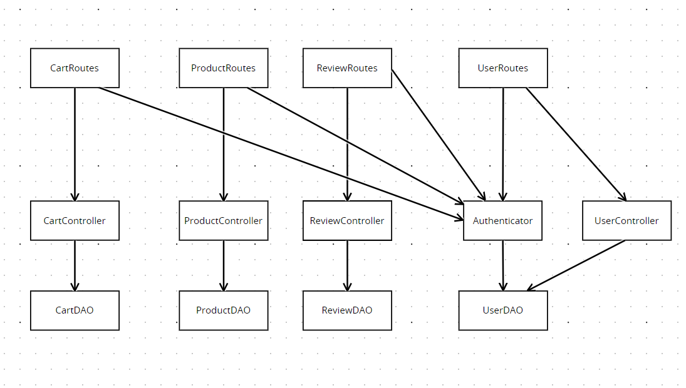
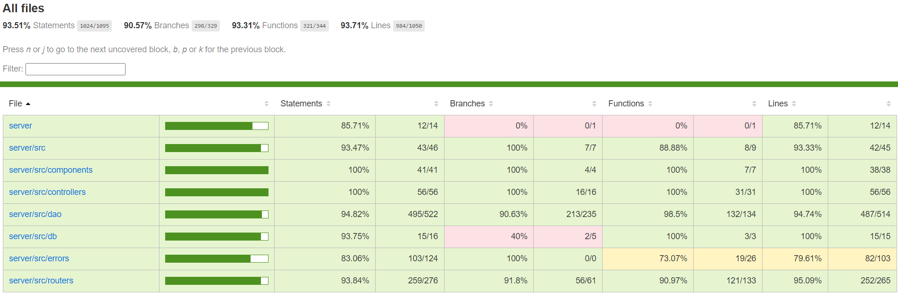
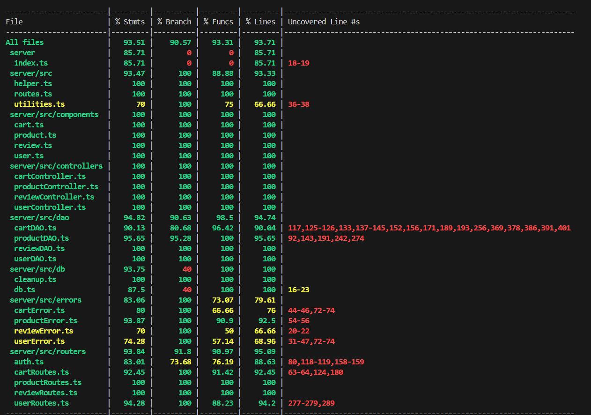

# Test Report

<The goal of this document is to explain how the application was tested, detailing how the test cases were defined and what they cover>

# Contents

- [Test Report](#test-report)
- [Contents](#contents)
- [Dependency graph](#dependency-graph)
- [Integration approach](#integration-approach)
- [Tests](#tests)
- [Coverage](#coverage)
  - [Coverage of FR](#coverage-of-fr)
  - [Coverage white box](#coverage-white-box)

# Dependency graph

   

# Integration approach

    Abbiamo seguito un approccio bottom-up per i test unitari, iniziando 
    dalle unità di base e avanzando verso componenti più complessi. 
    Successivamente, abbiamo condotto test di integrazione per verificare il corretto funzionamento congiunto dei diversi componenti,
     inclusi DAO, controller e rotte.

# Tests

<in the table below list the test cases defined For each test report the object tested, the test level (API, integration, unit) and the technique used to define the test case (BB/ eq partitioning, BB/ boundary, WB/ statement coverage, etc)> <split the table if needed>

|           Test case name           | Object(s) tested | Test level | Technique used |
|:----------------------------------:|:----------------:|:----------:|:--------------:|
| getIsUserAuthenticated - success              | `UserDAO`        | Unit       | WhiteBox       |
| getIsUserAuthenticated - error no username    | `UserDAO`        | Unit       | WhiteBox       |
| getIsUserAuthenticated - error wrong password | `UserDAO`        | Unit       | WhiteBox       |
| Get is user Authenticated - DB Crashed        | `UserDAO`        | Unit       | WhiteBox       |
| DB Error in Get is user Authenticated callback| `UserDAO`        | Unit       | WhiteBox       |
| createUser - should resolve true                              | `UserDAO`         | Unit       | WhiteBox       |
| createUser - should reject an UserAlreadyExistError           | `UserDAO`         | Unit       | WhiteBox       |
| createUser - DB Crashed                                      | `UserDAO`          | Unit       | WhiteBox       |
| createUser - DB Error in createUser callback                 | `UserDAO`          | Unit       | WhiteBox       |
| getUserByUsername - should resolve an user                         | `UserDAO`        | Unit       | WhiteBox       |
| getUserByUsername - should reject an UserNotFoundError             | `UserDAO`        | Unit       | WhiteBox       |
| getUserByUsername - DB Crashed                                      | `UserDAO`        | Unit       | WhiteBox       |
| getUserByUsername - DB Error in getUserByUsername callback          | `UserDAO`        | Unit       | WhiteBox       |
| getUsers - should resolve a list of users                           | `UserDAO`        | Unit       | WhiteBox       |
| getUsers - should resolve an empty list                             | `UserDAO`        | Unit       | WhiteBox       |
| getUsers - DB Crashed                                               | `UserDAO`        | Unit       | WhiteBox       |
| getUsers - DB Error in getUsers callback                            | `UserDAO`        | Unit       | WhiteBox       |
| getUsersByRole - should resolve a list of users                         | `UserDAO`        | Unit       | WhiteBox       |
| getUsersByRole - should resolve an empty list                           | `UserDAO`        | Unit       | WhiteBox       |
| getUsersByRole - DB Crashed                                             | `UserDAO`        | Unit       | WhiteBox       |
| getUsersByRole - DB Error in getUsersByRole callback                    | `UserDAO`        | Unit       | WhiteBox       |
| deleteUser - should resolve true                                        | `UserDAO`        | Unit       | WhiteBox       |
| deleteUser - should reject an UserNotFoundError                         | `UserDAO`        | Unit       | WhiteBox       |
| deleteUser - DB Crashed in get                                          | `UserDAO`        | Unit       | WhiteBox       |
| deleteUser - DB Error in get callback                                   | `UserDAO`        | Unit       | WhiteBox       |
| deleteUser - DB Crashed in run                                          | `UserDAO`        | Unit       | WhiteBox       |
| deleteUser - DB Error in run callback                                   | `UserDAO`        | Unit       | WhiteBox       |
| deleteNonAdminUsers - should resolve true                               | `UserDAO`        | Unit       | WhiteBox       |
| deleteNonAdminUsers - should reject if db.run returns an error          | `UserDAO`        | Unit       | WhiteBox       |
| deleteNonAdminUsers - should reject if an exception is thrown           | `UserDAO`        | Unit       | WhiteBox       |
| updateUserInfo - should update user info successfully                   | `UserDAO`       | Unit       | WhiteBox       |
| updateUserInfo - should reject if getUserByUsername fails with UserNotFoundError | `UserDAO`       | Unit       | WhiteBox       |
| updateUserInfo - should reject if getUserByUsername fails with general error | `UserDAO`       | Unit       | WhiteBox       |
| updateUserInfo - should reject if db.run returns an error                  | `UserDAO`       | Unit       | WhiteBox       |
| UserController.createUser - should return true            | `UserController`         | Unit       | White Box |
| UserController.createUser - should reject with UserAlreadyExistError | `UserController` | Unit       | White Box |
| UserController.createUser - should reject with an error when user creation fails | `UserController` | Unit       | White Box |
| UserController.getUsers - should return an array of users  | `UserController`         | Unit       | White Box |
| UserController.getUsers - should return an empty array if there are no users | `UserController` | Unit       | White Box |
| UserController.getUsers - should reject with an error when getting users fails | `UserController` | Unit       | White Box |
| UserController.getUsersByRole - should return an array of users | `UserController`      | Unit       | White Box |
| UserController.getUsersByRole - should return an empty array if there are no users with the specified role | `UserController` | Unit       | White Box |
| UserController.getUsersByRole - should throw an error if the retrieval fails | `UserController` | Unit       | White Box |
| UserController.getUserByUsername - should return a user   | `UserController`         | Unit       | White Box |
| UserController.getUserByUsername - should return an unauthorized error if the user is not an admin or the same as the requested user | `UserController` | Unit       | White Box |
| UserController.getUserByUsername - should return a user if the user is an admin | `UserController` | Unit       | White Box |
| UserController.getUserByUsername - should throw an error if the user is not found | `UserController` | Unit       | White Box |
| UserController.getUserByUsername - should throw an error if the retrieval fails | `UserController` | Unit       | White Box |
| Delete user - It should delete themselves | `UserController` | Unit | WhiteBox |
| Delete user - It should delete another user if the user is an admin | `UserController` | Unit | WhiteBox |
| Delete user - It should throw an unauthorized error if the user is not an admin and tries to delete another user | `UserController` | Unit | WhiteBox |
| Delete user - It should throw a UserIsAdminError if the user is an admin and tries to delete another admin | `UserController` | Unit | WhiteBox |
| Delete user - It should throw an error if the deletion fails | `UserController` | Unit | WhiteBox |
| Delete all non-admin users - It should return true | `UserController` | Unit | WhiteBox |
| Delete all non-admin users - It should throw an error if the deletion fails | `UserController` | Unit | WhiteBox |
| Update user Info - It should return the updated user | `UserController` | Unit | WhiteBox |
| Update user Info - It should update another user if the user is an admin | `UserController` | Unit | WhiteBox |
| Update user Info - It should throw an unauthorized error if the user is a Customer and is not the same as the requested user | `UserController` | Unit | WhiteBox |
| Update user Info - It should throw an error if the update fails | `UserController` | Unit | WhiteBox |
| POST /ezelectronics/users - It should return a 200 success code                                     | `UserRoutes`     | Unit| BlackBox       |
| POST /ezelectronics/users - It should return a 409 error code if the user already exists            | `UserRoutes`     | Unit| BlackBox       |
| POST /ezelectronics/users - It should return a 400 error code if the role is invalid                | `UserRoutes`     | Unit| BlackBox       |
| POST /ezelectronics/users - It should return a 400 error code if any required field is missing      | `UserRoutes`     | Unit| BlackBox       |
| POST /ezelectronics/users - It should return a 503 error code if createUser throws a generic error | `UserRoutes`     | Unit| BlackBox       |
| GET /users - should get the list of users for the logged-in admin                                                                | `UserRoutes`   | Unit   | BlackBox      |
| GET /users - should return 401 Forbidden for non-admin user                                                                      | `UserRoutes`   | Unit   | BlackBox      |
| GET /users - should return 503 Internal Server Error when getUsers fails                                                        | `UserRoutes`   | Unit   | BlackBox      |
| GET /roles/:role - should get the list of users for a valid role for the logged-in admin                                          | `UserRoutes`   | Unit   | BlackBox      |
| GET /roles/:role - should return 400 for an invalid role                                                                          | `UserRoutes`   | Unit   | BlackBox      |
| GET /roles/:role - should return 401 for a non-admin user                                                                         | `UserRoutes`   | Unit   | BlackBox      |
| GET /roles/:role - should return 500 if getUsersByRole fails                                                                      | `UserRoutes`   | Unit   | BlackBox      |
| GET /:username - It should resolve a 200 if an admin get a username exists in the database                                       | `UserRoutes`   | Unit   | BlackBox      |
| GET /:username - It should resolve a 200 if a user retrieve their own data                                                        | `UserRoutes`   | Unit   | BlackBox      |
| GET /:username - It should resolve a 404 if a username does not exist in the database                                             | `UserRoutes`   | Unit   | BlackBox      |
| GET /:username - It should resolve a 401 if a user is not an admin                                                               | `UserRoutes`   | Unit   | BlackBox      |
| GET /:username - It should resolve a 503 if the database is down                                                                  | `UserRoutes`   | Unit   | BlackBox      |
| DELETE /:username - It should resolve a 200 if an admin deletes a user                                                            | `UserRoutes`   | Unit   | BlackBox      |
| DELETE /:username - It should resolve a 200 if a user deletes their own account                                                    | `UserRoutes`   | Unit   | BlackBox      |
| DELETE /:username - It should resolve a 404 if a username does not exist in the database                                           | `UserRoutes`   | Unit   | BlackBox      |
| DELETE /:username - It should resolve a 401 if a user is not an admin                                                             | `UserRoutes`   | Unit   | BlackBox      |
| DELETE /:username - It should resolve a 503 if the database is down                                                                | `UserRoutes`   | Unit   | BlackBox      |
| DELETE /users - It should resolve a 200 if a user is logged in                                                                     | `UserRoutes`   | Unit   | BlackBox      |
| DELETE /users - It should resolve a 401 if a user is not an admin                                                                 | `UserRoutes`   | Unit   | BlackBox      |
| DELETE /users - It should resolve a 503 if the database is down                                                                    | `UserRoutes`   | Unit   | BlackBox      |
| PATCH /:username - It should resolve a 200 if a username exists in the database and return the modified user, called by an admin | `UserRoutes`   | Unit   | BlackBox      |
| PATCH /:username - It should resolve a 200 if a username exists in the database and return himself, called by customer or manager| `UserRoutes`   | Unit   | BlackBox      |
| PATCH /:username - It should resolve a 401 if a user is not logged in                                                             | `UserRoutes`   | Unit   | BlackBox      |
| PATCH /:username - It should resolve a 401 if a user is not an admin and tries to modify another user                             | `UserRoutes`   | Unit   | BlackBox      |
| PATCH /:username - It should resolve a 401 if a user is admin and tries to modify another admin                                   | `UserRoutes`   | Unit   | BlackBox      |
| PATCH /:username - It should resolve a 400 error if any of the fields is empty                                                    | `UserRoutes`   | Unit   | BlackBox      |
| PATCH /:username - It should resolve a 400 error if the birthdate is after the current date                                       | `UserRoutes`   | Unit   | BlackBox      |
| PATCH /:username - It should resolve a 404 if a username does not exist in the database                                           | `UserRoutes`   | Unit   | BlackBox      |
| PATCH /:username - It should resolve a 503 if the database is down                                                                | `UserRoutes`   | Unit   | BlackBox      |
| Create User - success              | `UserRoutes`     | Integration | BlackBox       |
| Create User - user already exists  | `UserRoutes`     | Integration | BlackBox       |
| Get User - success                  | `UserRoutes`     | Integration | BlackBox       |
| Get User - unauthorized access      | `UserRoutes`     | Integration | BlackBox       |
| Get User By Role - success          | `UserRoutes`     | Integration | BlackBox       |
| Get User By Role - unauthorized access | `UserRoutes`  | Integration | BlackBox       |
| Get User By Username - success      | `UserRoutes`     | Integration | BlackBox       |
| Get User By Username - username does not exist | `UserRoutes` | Integration | BlackBox       |
| Delete User - ADMIN delete CUSTOMER | `UserRoutes`    | Integration | BlackBox       |
| Delete User - ADMIN delete ANOTHER ADMIN | `UserRoutes`| Integration | BlackBox       |
| DeleteAll User - success            | `UserRoutes`     | Integration | BlackBox       |
| Update user info - USER UPDATE HIS INFO | `UserRoutes` | Integration | BlackBox       |
| Update user info - ERROR 401        | `UserRoutes`     | Integration | BlackBox       |
| Add review - success | `ReviewDAO`| Unit |WhiteBox |
| Add review - reject with ProductNotFoundError | `ReviewDAO`| Unit | WhiteBox |
| Add review - reject with ExistingReviewError | `ReviewDAO`| Unit | WhiteBox |
| Add review - reject with error | `ReviewDAO`| Unit | WhiteBox |
| Add review - DB Crashed | `ReviewDAO`| Unit | WhiteBox |
| Add review - DB Error | `ReviewDAO`| Unit | WhiteBox |
| getProductReviews - success | `ReviewDAO`| Unit | WhiteBox |
| getProductReviews - DB Crashed | `ReviewDAO`| Unit | WhiteBox |
| getProductReviews - reject with error | `ReviewDAO`| Unit | WhiteBox |
| deleteReview - success | `ReviewDAO`| Unit | WhiteBox |
| deleteReview - reject with error | `ReviewDAO`| Unit | WhiteBox |
| deleteReview - reject with ProductNotFoundError | `ReviewDAO`| Unit | WhiteBox |
| deleteReview - reject with ExistingReviewError | `ReviewDAO`| Unit | WhiteBox |
| deleteReview - DB Crashed | `ReviewDAO`| Unit | WhiteBox |
 | deleteReview - DB Error | `ReviewDAO`| Unit | WhiteBox |
  | deleteReviewsOfProduct - success | `ReviewDAO`| Unit | WhiteBox |
| deleteReviewsOfProduct - reject with error | `ReviewDAO`| Unit | WhiteBox |
| deleteReviewsOfProduct - reject with ProductNotFoundError | `ReviewDAO`| Unit | WhiteBox |
| deleteReviewsOfProduct -  DB Crashed | `ReviewDAO`| Unit | WhiteBox |
| deleteReviewsOfProduct -  DB Error | `ReviewDAO`| Unit | WhiteBox |
| deleteAllReview - success | `ReviewDAO`| Unit | WhiteBox|
| deleteAllReview - reject with error | `ReviewDAO`| Unit | WhiteBox |
| addReview - should return true | `ReviewController`| Unit | WhiteBox |
| getProductReviews - should return an array of reviews | `ReviewController`| Unit | WhiteBox |
| deleteReview - should return to nothing | `ReviewController`| Unit | WhiteBox |
| deleteReviewsOfProduct - should return to nothing | `ReviewController`| Unit | WhiteBox |
| deleteAllReview - should return to nothing | `ReviewController`| Unit | WhiteBox |
| POST/:model - success | `ReviewRoutes`| Unit | BlackBox |
|  POST/:model  - user not logged | `ReviewRoutes`| Unit | BlackBox |
|  POST/:model  - user not customer | `ReviewRoutes`| Unit | BlackBox |
|  POST/:model  - model empty string | `ReviewRoutes`| Unit | BlackBox |
|  POST/:model  - comment empty string | `ReviewRoutes`| Unit | BlackBox |
|  POST/:model  - score not integer | `ReviewRoutes`| Unit | BlackBox |
|  POST/:model  - database error 503 | `ReviewRoutes`| Unit | BlackBox |
| GET/:model - success | `ReviewRoutes`| Unit | BlackBox |
| GET/:model - user not logged | `ReviewRoutes`| Unit | BlackBox |
| GET/:model - database error 503 | `ReviewRoutes`| Unit | BlackBox |
| DELETE/:model - success | `ReviewRoutes`| Unit | BlackBox |
|  DELETE/:model - user not logged | `ReviewRoutes`| Unit | BlackBox |
|  DELETE/:model - user not customer | `ReviewRoutes`| Unit | BlackBox |
|  DELETE/:model - database error 503 | `ReviewRoutes`| Unit | BlackBox |
|  DELETE/:model/:all - success | `ReviewRoutes`| Unit | BlackBox |
| DELETE/:model/:all - user not logged | `ReviewRoutes`| Unit | BlackBox |
| DELETE/:model/:all - user not admin or manager | `ReviewRoutes`| Unit | BlackBox |
| DELETE/ - success | `ReviewRoutes`| Unit | BlackBox |
| DELETE/ - user not logged | `ReviewRoutes`| Unit | WhiteBox |
| DELETE/ - user not admin or manager | `ReviewRoutes`| Unit | BlackBox |
| DELETE/ - database error 503 | `ReviewRoutes`| Unit | BlackBox |
| addReview - success | `ReviewRoutes`| Integration | BlackBox |
| addReview - product not found | `ReviewRoutes`| Integration | BlackBox |
| addReview - error of score | `ReviewRoutes`| Integration | BlackBox |
| addReview - error of comment | `ReviewRoutes`| Integration | BlackBox |
| getProductReviews - success | `ReviewRoutes`| Integration | BlackBox |
| deleteReview - success | `ReviewRoutes`| Integration | BlackBox |
| deleteReview - product not found | `ReviewRoutes`| Integration | BlackBox |
| deleteReview - existing review | `ReviewRoutes`| Integration | BlackBox |
| deleteReviewsOfProduct - success | `ReviewRoutes`| Integration | BlackBox |
| deleteReviewsOfProduct - product not found | `ReviewRoutes`| Integration | BlackBox |
| deleteReviewsOfProduct - model empty | `ReviewRoutes`| Integration | BlackBox |
| deleteAllReviews - success | `ReviewRoutes`| Integration | BlackBox |
| RegisterProducts - Should return a message of success | `ProductDAO` | Unit | WhiteBox |
| RegisterProducts - Should return a message of error if ProductAlreadyExistsError is thrown | `ProductDAO` | Unit | WhiteBox |
| RegisterProducts - Should return a message of error if InvalidInput is thrown | `ProductDAO` | Unit | WhiteBox |
| RegisterProducts - Should return a message of error if ArrivalAfterCurrentError is thrown | `ProductDAO` | Unit | WhiteBox |
| RegisterProducts - DB Error | `ProductDAO` | Unit | WhiteBox |
| RegisterProducts - Error in get query | `ProductDAO` | Unit | WhiteBox |
| RegisterProducts - Error in run query | `ProductDAO` | Unit | WhiteBox |
| ChangeProductQuantity - Should return a message of success | `ProductDAO` | Unit | WhiteBox |
| ChangeProductQuantity - Should return a message of error if ProductNotFoundError is thrown | `ProductDAO` | Unit | WhiteBox |
| ChangeProductQuantity - Should return a message of error if ChangeDate is after CurrentDate | `ProductDAO` | Unit | WhiteBox |
| ChangeProductQuantity - Should return a message of error if ChangeDate is before ArrivalDate | `ProductDAO` | Unit | WhiteBox |
| ChangeProductQuantity - Error in get query | `ProductDAO` | Unit | WhiteBox |
| ChangeProductQuantity - It should reject if there is an error in the query | `ProductDAO` | Unit | WhiteBox |
| SellProduct - Should return a message of success | `ProductDAO` | Unit | WhiteBox |
| SellProduct - Should return a message of error if SellingDate is after CurrentDate | `ProductDAO` | Unit | WhiteBox |
| SellProduct - Should return an error if model does not represent a product in the database | `ProductDAO` | Unit | WhiteBox |
| SellProduct - Should return a message of error if SellingDate is before ArrivalDate | `ProductDAO` | Unit | WhiteBox |
| SellProduct - Should return a message of error if quantity of product is 0 | `ProductDAO` | Unit | WhiteBox |
| SellProduct - Should return a message of error if requested quantity of product is greater than available quantity | `ProductDAO` | Unit | WhiteBox |
| SellProduct - It should reject if there is an error in the query | `ProductDAO` | Unit | WhiteBox |
| GetProducts - Should return all products if grouping is null and category and model are null | `ProductDAO` | Unit | WhiteBox |
| GetProducts- Should return all products if grouping of one category is category and category is not null | `ProductDAO` | Unit | WhiteBox |
| GetProducts - Should return all products if grouping is model and model is not null | `ProductDAO` | Unit | WhiteBox |
| GetProducts - Should return error if grouping is null and any of category or model is not null | `ProductDAO` | Unit | WhiteBox |
| GetProducts - Should return error if grouping is category and category is null or model is not null | `ProductDAO` | Unit | WhiteBox |
| GetProducts - Should return error if grouping is model and model is null or category is not null | `ProductDAO` | Unit | WhiteBox |
| GetProducts - Should return an error if model does not represent a product in the database (only when grouping is model) | `ProductDAO` | Unit | WhiteBox |
| GetProducts - It should reject if there is an error in the product query | `ProductDAO` | Unit | WhiteBox |
| GetAvailableProducts - Should return all products if grouping is null and category and model are null | `ProductDAO` | Unit | WhiteBox |
| GetAvailableProducts - Should return all products if grouping of one category is category and category is not null | `ProductDAO` | Unit | WhiteBox |
| GetAvailableProducts - Should return all products if grouping is model and model is not null | `ProductDAO` | Unit | WhiteBox |
| GetAvailableProducts - Should return error if grouping is null and any of category or model is not null | `ProductDAO` | Unit | WhiteBox |
| GetAvailableProducts - Should return error if grouping is category and category is null or model is not null | `ProductDAO` | Unit | WhiteBox |
| GetAvailableProducts - Should return error if grouping is model and model is null or category is not null | `ProductDAO` | Unit | WhiteBox |
| GetAvailableProducts - Should return an error if model does not represent a product in the database (only when grouping is model) | `ProductDAO` | Unit | WhiteBox |
| GetAvailableProducts - It should reject if there is an error in the product query | `ProductDAO` | Unit | WhiteBox |
| DeleteAllProducts - Should delete all products from the database | `ProductDAO` | Unit | WhiteBox |
| DeleteAllProducts - It should reject with an error if there is an error in the database query | `ProductDAO` | Unit | WhiteBox |
| DeleteProduct - Should delete a product if model exists in the database | `ProductDAO` | Unit | WhiteBox |
| DeleteProduct - Should return a 404 error if model does not represent a product in the database | `ProductDAO` | Unit | WhiteBox |
| DeleteProduct - It should reject with an error if there is an error in the database query | `ProductDAO` | Unit | WhiteBox |
| RegisterProduct - Should return a message of success | `ProductController` | Unit | WhiteBox |
| ChangeProductQuantity - Should return a message of success | `ProductController` | Unit | WhiteBox |
| SellProduct - Should return a message of success | `ProductController` | Unit | WhiteBox |
| GetProducts - Should return a message of success | `ProductController` | Unit | WhiteBox |
| GetAvailableProduct - Should return a message of success | `ProductController` | Unit | WhiteBox |
| DeleteAllProducts - Should return a message of success | `ProductController` | Unit | WhiteBox |
| DeleteProduct - Should return a message of success | `ProductController` | Unit | WhiteBox |
| RegisterProduct - It should return a 200 success code if a product is registered from Manager | `ProductRoutes` | Unit | BlackBox |
| RegisterProduct - It should return a 401 error code if a product is registered from Customer | `ProductRoutes` | Unit | BlackBox |
| RegisterProduct - It should return a 401 error code if a product is registered without being logged in | `ProductRoutes` | Unit | BlackBox |
| RegisterProduct - It should return a 409 error code if model represents an already existing ser of products in the database | `ProductRoutes` | Unit | BlackBox |
| RegisterProduct - It should return a a 400 error code when arrivalDate is after the current date | `ProductRoutes` | Unit | BlackBox |
| ChangeProductQuantity - It should return a 200 success code if a product is update correctly | `ProductRoutes` | Unit | BlackBox |
| ChangeProductQuantity - It should return a a 400 error code when changeDate is after the current date | `ProductRoutes` | Unit | BlackBox |
| ChangeProductQuantity - It should return a a 400 error code when changeDate is before the arrivalDate | `ProductRoutes` | Unit | BlackBox |
| ChangeProductQuantity - It should return a 404 error code if product is not found | `ProductRoutes` | Unit | BlackBox |
| SellProduct - It should return a 200 success code if a product is sell correctly | `ProductRoutes` | Unit | BlackBox |
| SellProduct - It should return a a 400 error code when sellingDate is after the current date | `ProductRoutes` | Unit | BlackBox |
| SellProduct - It should return a a 400 error code when sellingDate is before the arrivalDate | `ProductRoutes` | Unit | BlackBox |
| SellProduct - It should return a 404 error code if product is not found | `ProductRoutes` | Unit | BlackBox |
| SellProduct - It should return a 409 error code if model represents a product whose available quantity is 0 | `ProductRoutes` | Unit | BlackBox |
| SellProduct - It should return a 409 error if the available quantity of model is lower than the requested quantity | `ProductRoutes` | Unit | BlackBox |
| GetProducts - It should return a 200 success code if return all products | `ProductRoutes` | Unit | BlackBox |
| GetProducts - It should return a 200 success code if return all products by category | `ProductRoutes` | Unit | BlackBox |
| GetProducts - It should return a 200 success code if return all products by model | `ProductRoutes` | Unit | BlackBox |
| GetProducts - It should return a 422 error if grouping is category and category is null OR model is not null | `ProductRoutes` | Unit | BlackBox |
| GetProducts - It should return a 422 error if grouping is model and model is null OR category is not null | `ProductRoutes` | Unit | BlackBox |
| GetProducts - It should return a 422 error if grouping is null and any of category or model is not null | `ProductRoutes` | Unit | BlackBox |
| GetProducts - It should return 503 if there is a database error during product retrieval | `ProductRoutes` | Unit | BlackBox |
| GetAvailableProducts - It should return a 200 success code if return all products | `ProductRoutes` | Unit | BlackBox |
| GetAvailableProducts - It should return a 200 success code if return all products by category | `ProductRoutes` | Unit | BlackBox |
| GetAvailableProducts - It should return a 200 success code if return all products by model | `ProductRoutes` | Unit | BlackBox |
| GetAvailableProducts - It should return a 422 error if grouping is category and category is null OR model is not null | `ProductRoutes` | Unit | BlackBox |
| GetAvailableProducts - It should return a 422 error if grouping is model and model is null OR category is not null | `ProductRoutes` | Unit | BlackBox |
| GetAvailableProducts - It should return a 422 error if grouping is null and any of category or model is not null | `ProductRoutes` | Unit | BlackBox |
| GetAvailableProducts - It should return 503 if there is a database error during product retrieval | `ProductRoutes` | Unit | BlackBox |
| DeleteProduct - It should return a 200 success code if return all products | `ProductRoutes` | Unit | BlackBox |
| DeleteProduct - It should return a 404 error if model does not represent a product in the database | `ProductRoutes` | Unit | BlackBox |
| DeleteAllProduct - It should return a 200 success code if return all products | `ProductRoutes` | Unit | BlackBox |
| DeleteAllProduct - should return 500 if there is a database error during deletion | `ProductRoutes` | Unit | BlackBox |
| POST/Products - Should register a new product | `ProductIntegration` | Integration | BlackBox |
| POST/Products - Should not register a new product if the user is customer | `ProductIntegration` | Integration | BlackBox |
| POST/Products - It should return a 409 error if model represents an already existing set of products in the database | `ProductIntegration` | Integration | BlackBox |
| POST/products - It should return a 422 error if the model is missing | `ProductIntegration` | Integration | BlackBox |
| POST/products - It should return a 422 error if the category is missing | `ProductIntegration` | Integration | BlackBox |
| POST/products - It should return a 422 error if the quantity is missing | `ProductIntegration` | Integration | BlackBox |
| POST/products - It should return a 422 error if the quantity is less than 0 | `ProductIntegration` | Integration | BlackBox |
| POST/products - It should return a 422 error if the sellingPrice is missing | `ProductIntegration` | Integration | BlackBox |
| POST/products - It should return a 422 error if the sellingPrice is less than 0 | `ProductIntegration` | Integration | BlackBox |
| POST/products - It should return a 400 error when arrivalDate is after currentDate | `ProductIntegration` | Integration | BlackBox |
| PATCH/products/:model - Should change the quantity of a product | `ProductIntegration` | Integration | BlackBox |
| PATCH/products/:model - Should not change the quantity of a product if the user is customer | `ProductIntegration` | Integration | BlackBox |
| PATCH/products/:model - It should return a 404 error if model does not represent a product in the database | `ProductIntegration` | Integration | BlackBox |
| PATCH/products/:model - It should return a 400 error if changeDate is after the current date | `ProductIntegration` | Integration | BlackBox |
| PATCH/products/:model - It should return a 400 error if changeDate is before the product's arrivalDate | `ProductIntegration` | Integration | BlackBox |
| PATCH/products/:model/sell - Should sell a product | `ProductIntegration` | Integration | BlackBox |
| PATCH/products/:model/sell - Should not sell a product if the user is customer | `ProductIntegration` | Integration | BlackBox |
| PATCH/products/:model/sell - It should return a 404 error if model does not represent a product in the database | `ProductIntegration` | Integration | BlackBox |
| PATCH/products/:model/sell - It should return a 400 error if sellingDate is after the current date | `ProductIntegration` | Integration | BlackBox |
| PATCH/products/:model/sell - It should return a 400 error if sellingDate is before the product's arrivalDate | `ProductIntegration` | Integration | BlackBox |
| PATCH/products/:model/sell - It should return a 409 error if the available quantity of model is lower than the requested quantity | `ProductIntegration` | Integration | BlackBox |
| GET/products - Should return all product by Admin or Manager | `ProductIntegration` | Integration | BlackBox |
| GET/products - Should return error by Customer | `ProductIntegration` | Integration | BlackBox |
| GET/products - It should return a 422 error if grouping is null and any of category or model is not null | `ProductIntegration` | Integration | BlackBox |
| GET/products - It should return a 422 error if grouping is category and category is null OR model is not null | `ProductIntegration` | Integration | BlackBox |
| GET/products - It should return a 422 error if grouping is model and model is null OR category is not null | `ProductIntegration` | Integration | BlackBox |
| GET/products - It should return a 404 error if model does not represent a product in the database (only when grouping is model) | `ProductIntegration` | Integration | BlackBox |
| GET/products/available - Should return all product by User | `ProductIntegration` | Integration | BlackBox |
| GET/products/available - It should return a 422 error if grouping is null and any of category or model is not null | `ProductIntegration` | Integration | BlackBox |
| GET/products/available - It should return a 422 error if grouping is category and category is null OR model is not null | `ProductIntegration` | Integration | BlackBox |
| GET/products/available - It should return a 422 error if grouping is model and model is null OR category is not null | `ProductIntegration` | Integration | BlackBox |
| GET/products/available - It should return a 404 error if model does not represent a product in the database (only when grouping is model) | `ProductIntegration` | Integration | BlackBox |
| DELETE/products/:model - Should delete a product | `ProductIntegration` | Integration | BlackBox |
| DELETE/products/:model - Should not delete a product if the user is customer | `ProductIntegration` | Integration | BlackBox |
| DELETE/products/:model - It should return a 404 error if model does not represent a product in the database | `ProductIntegration` | Integration | BlackBox |
| DELETE/products - Should delete all products | `ProductIntegration` | Integration | BlackBox |
| DELETE/products - Should not delete all products if the user is customer | `ProductIntegration` | Integration | BlackBox |
|getCart should resolve with a Cart object when the cart exists|`CartDAO`|Unit|WhiteBox|
|getCart should reject with an error when SELECT query fails|`CartDAO`|Unit|WhiteBox|
|getCart should resolve with a new Cart instance when row is null|`CartDAO`|Unit|WhiteBox|
|getCart should reject with an error when SELECT query for ProductsInCart fails|`CartDAO`|Unit|WhiteBox|
|getCart should resolve with a new Cart instance when rows is null or empty|`CartDAO`|Unit|WhiteBox|
|addToCart should resolve with true when product is added successfully|`CartDAO`|Unit|WhiteBox|
|addToCart should reject with ProductNotInCartError when product does not exist|`CartDAO`|Unit|WhiteBox|
|addToCart should reject with ProductQuantityError when product quantity is 0 |`CartDAO`|Unit|WhiteBox|
|addToCart should reject with SQL Error when there is a database error|`CartDAO`|Unit|WhiteBox|
|addToCart should reject with SQL Error when inserting into ProductInCart fails|`CartDAO`|Unit|WhiteBox|
|addToCart should reject with SQL Error when updating Cart fails|`CartDAO`|Unit|WhiteBox|
|addToCart should reject with SQL Error when updating Cart fails after inserting into ProductInCart|`CartDAO`|Unit|WhiteBox|
|addToCart should reject with an error when SELECT query fails|`CartDAO`|Unit|WhiteBox|
|checkoutCart should resolve with true when checkout is successful|`CartDAO`|Unit|WhiteBox|
|checkoutCart should reject with CartNotFoundError when cart does not exist|`CartDAO`|Unit|WhiteBox|
|checkoutCart should reject with ProductQuantityError when product quantity in cart is more than available quantity|`CartDAO`|Unit|WhiteBox|
|checkoutCart should reject with EmptyCartError when no products are in the cart|`CartDAO`|Unit|WhiteBox|
|checkoutCart should reject with EmptyProductStockError when product quantity is zero|`CartDAO`|Unit|WhiteBox|
|checkout should reject with SQL Error when selecting from Cart fails|`CartDAO`|Unit|WhiteBox|
|checkout should reject with SQL Error when selecting from ProductInCart fails|`CartDAO`|Unit|WhiteBox|
|checkoutCart should reject with SQL Error when selecting from Product fails|`CartDAO`|Unit|WhiteBox|
|checkout should reject with ProductNotFoundError when product is not found |`CartDAO`|Unit|WhiteBox|
|checkout should reject with SQL Error when updating Product fails|`CartDAO`|Unit|WhiteBox|
|checkout should reject with SQL Error when updating Cart fails|`CartDAO`|Unit|WhiteBox|
|getCustomerCarts should resolve with an array of Cart objects when carts exist|`CartDAO`|Unit|WhiteBox|
|getCustomerCarts should resolve with an empty array when no carts exist|`CartDAO`|Unit|WhiteBox|
|getCustomersCarts should reject with SQL Error when selecting from Cart fails|`CartDAO`|Unit|WhiteBox|
|removeProductFromCart should resolve with true when product is successfully removed|`CartDAO`|Unit|WhiteBox|
|removeProductFromCart should reject with ProductNotFoundError when product does not exist|`CartDAO`|Unit|WhiteBox|
|removeProductFromCart should reject with CartNotFoundError when cart does not exist|`CartDAO`|Unit|WhiteBox|
|removeProductFromCart should reject with SQL Error when selecting from Product fails|`CartDAO`|Unit|WhiteBox|
|removeProductFromCart should reject with SQL Error when selecting from Cart fails|`CartDAO`|Unit|WhiteBox|
|removeProductFromCart should reject with SQL Error when updating ProductInCart fails |`CartDAO`|Unit|WhiteBox|
|removeProductFromCart should reject with SQL Error when updating Cart total fails|`CartDAO`|Unit|WhiteBox|
|removeProductFromCart should reject with EmptyCartError when cart is empty|`CartDAO`|Unit|WhiteBox|
|clearCart should resolve with true when cart is successfully cleared|`CartDAO`|Unit|WhiteBox|
|clearCart should reject with SQL Error|`CartDAO`|Unit|WhiteBox|
|clearCart should reject with CartNotFoundError|`CartDAO`|Unit|WhiteBox|
|clearCart should reject with SQL Error when deleting from ProductInCart|`CartDAO`|Unit|WhiteBox|
|clearCart should reject with SQL Error when updating Cart|`CartDAO`|Unit|WhiteBox|
|getAllCarts should resolve with all carts when there are carts in the database|`CartDAO`|Unit|WhiteBox|
|getAllCarts should resolve with an empty array when there are no carts|`CartDAO`|Unit|WhiteBox|
|getAllCarts should reject with an error when the database operation fails|`CartDAO`|Unit|WhiteBox|
|deleteAllCarts should resolve with true when all carts are successfully deleted |`CartDAO`|Unit|WhiteBox|
|deleteAllCarts should reject with an error when deleting from ProductInCart fails|`CartDAO`|Unit|WhiteBox|
|deleteAllCarts should reject with an error when deleting from Cart fails|`CartDAO`|Unit|WhiteBox|
|lastID should throw a Method not implemented error|`CartDAO`|Unit|WhiteBox|
|addToCart should add a new product to the cart|`CartController`|Unit|WhiteBox|
|addToCart should handle errors|`CartController`|Unit|WhiteBox|
|getCart should retrieve the current cart for a specific user|`CartController`|Unit|WhiteBox|
|getCart should return an empty cart if there is no current cart for the user|`CartController`|Unit|WhiteBox|
|checkoutCart should checkout the user's cart|`CartController`|Unit|WhiteBox|
|checkoutCart should handle errors|`CartController`|Unit|WhiteBox|
|getCustomerCarts should retrieve all paid carts for a specific customer |`CartController`|Unit|WhiteBox|
|getCustomerCarts should handle errors|`CartController`|Unit|WhiteBox|
|removeProductFromCart should remove one product unit from the current cart|`CartController`|Unit|WhiteBox|
|removeProductFromCart should handle errors|`CartController`|Unit|WhiteBox|
|clearCart should remove all products from the current cart|`CartController`|Unit|WhiteBox|
|clearCart should handle errors |`CartController`|Unit|WhiteBox|
|deleteAllCarts should delete all carts of all users|`CartController`|Unit|WhiteBox|
|deleteAllCarts should handle errors|`CartController`|Unit|WhiteBox|
|getAllCarts should retrieve all carts in the database|`CartController`|Unit|WhiteBox|
|getAllCarts should handle errors|`CartController`|Unit|WhiteBox|
|GET/should return a 200 success code and the cart if the user is authenticated and is a customer|`CartRoutes`|Unit|BlackBox|
|GET/should handle errors when retrieving a cart|`CartRoutes`|Unit|BlackBox|
|POST/should add a product to the cart|`CartRoutes`|Unit|BlackBox|
|POST/should not add a product to the cart if user is not a customer|`CartRoutes`|Unit|BlackBox|
|POST/should return 422 if product model is not provided|`CartRoutes`|Unit|BlackBox|
|POST/should return 409 if product quantity is 0|`CartRoutes`|Unit|BlackBox|
|POST/should return 401 if user is not logged in|`CartRoutes`|Unit|BlackBox|
|PATCH/should checkout the cart|`CartRoutes`|Unit|BlackBox|
|PATCH/should not checkout the cart if user is not a customer|`CartRoutes`|Unit|BlackBox|
|PATCH/should return 401 if user is not logged in|`CartRoutes`|Unit|BlackBox|
|GET/should get the history of the customer's carts|`CartRoutes`|Unit|BlackBox|
|GET/should not get the history if user is not a customer|`CartRoutes`|Unit|BlackBox|
|GET/should return 401 if user is not logged in|`CartRoutes`|Unit|BlackBox|
|DELETE/products/:model-should return a 200 success code if a product is removed from the cart|`CartRoutes`|Unit|BlackBox|
|DELETE/products/:model-should not remove the product if user is not a customer|`CartRoutes`|Unit|BlackBox|
|DELETE/products/:model-should return 401 if user is not logged in|`CartRoutes`|Unit|BlackBox|
|DELETE/products/:model-should return 404 if the product does not exist|`CartRoutes`|Unit|BlackBox|
|DELETE/current-should return a 200 success code if all products are removed from the cart|`CartRoutes`|Unit|BlackBox|
|DELETE/current-should not remove the products if user is not a customer|`CartRoutes`|Unit|BlackBox|
|DELETE/current-should return 401 if user is not logged i|`CartRoutes`|Unit|BlackBox|
|DELETE/current-should return 404 if the user does not have a current cart|`CartRoutes`|Unit|BlackBox|
|DELETE/-should return a 200 success code if all carts are deleted|`CartRoutes`|Unit|BlackBox|
|DELETE/-should return a 200 success code if all carts are deleted by a manager|`CartRoutes`|Unit|BlackBox|
|DELETE/-should not delete the carts if user is not an admin or a manager |`CartRoutes`|Unit|BlackBox|
|DELETE/-should return 401 if user is not logged in|`CartRoutes`|Unit|BlackBox|
|GET/all-should return all carts if user is an admin|`CartRoutes`|Unit|BlackBox|
|GET/all-should return all carts if user is a manager |`CartRoutes`|Unit|BlackBox|
|GET/all-should not return carts if user is not an admin or a manager|`CartRoutes`|Unit|BlackBox|
|GET/all-should return 401 if user is not logged in|`CartRoutes`|Unit|BlackBox|
|GET/all-should handle errors when retrieving all carts|`CartRoutes`|Unit|BlackBox|
|GET ezelectronics/carts-Get current cart that exists and contains products|`CartIntegrationn`|Integration|BlackBox|
|GET ezelectronics/carts- Get current cart that exists and is empty|`CartIntegrationn`|Integration|BlackBox|
|GET ezelectronics/carts-Get current cart that not exists|`CartIntegrationn`|Integration|BlackBox|
|GET ezelectronics/carts-Get current cart by a not authenticated user |`CartIntegrationn`|Integration|BlackBox|
|GET ezelectronics/carts-Get current cart by a not customer user|`CartIntegrationn`|Integration|BlackBox|
|POST ezelectronics/carts-Add an existing product to an existing cart that doesn't constain it|`CartIntegrationn`|Integration|BlackBox|
|POST ezelectronics/carts-Add an existing product to an existing cart that already constains it|`CartIntegrationn`|Integration|BlackBox|
|POST ezelectronics/carts-Add an existing product to a not existing cart|`CartIntegrationn`|Integration|BlackBox|
|POST ezelectronics/carts-Add a product that not exists to a cart|`CartIntegrationn`|Integration|BlackBox|
|POST ezelectronics/carts-Add a product that not exists to a cart|`CartIntegrationn`|Integration|BlackBox|
|POST ezelectronics/carts-Add a product whose model is an empty string to a cart |`CartIntegrationn`|Integration|BlackBox|
|POST ezelectronics/carts-Add a product whose quantity is 0 to a cart |`CartIntegrationn`|Integration|BlackBox|
|POST ezelectronics/carts-Add a product whose quantity by a not authenticated user|`CartIntegrationn`|Integration|BlackBox|
|POST ezelectronics/carts-Add a product whose quantity by a not authenticated user|`CartIntegrationn`|Integration|BlackBox|
|PATCH ezelectronics/carts-Check out existing cart with products|`CartIntegrationn`|Integration|BlackBox|
|PATCH ezelectronics/carts-Check out not existing cart|`CartIntegrationn`|Integration|BlackBox|
|PATCH ezelectronics/carts-Check out empty cart |`CartIntegrationn`|Integration|BlackBox|
|PATCH ezelectronics/carts-Check out existing cart with that contains a product whose quantity is 0 |`CartIntegrationn`|Integration|BlackBox|
|PATCH ezelectronics/carts-Check out existing cart with that contains a product whose quantity is not enough|`CartIntegrationn`|Integration|BlackBox|
|PATCH ezelectronics/carts-Check out cart by unauthenticated user |`CartIntegrationn`|Integration|BlackBox|
|PATCH ezelectronics/carts-Check out cart by user that is not a customer |`CartIntegrationn`|Integration|BlackBox|
|GET ezelectronics/carts/history-Get carts history with 2 paid carts|`CartIntegrationn`|Integration|BlackBox|
|GET ezelectronics/carts/history-Get carts history with no carts|`CartIntegrationn`|Integration|BlackBox|
|GET ezelectronics/carts/history-Get carts history by an unauthenticated user|`CartIntegrationn`|Integration|BlackBox|
|GET ezelectronics/carts/history-Get carts history by user that is not customer|`CartIntegrationn`|Integration|BlackBox|
|DELETE ezelectronics/carts/products/:model-Remove an existing product from a cart that contains it|`CartIntegrationn`|Integration|BlackBox|
|DELETE ezelectronics/carts/products/:model-Remove an existing (last) product from a cart that contains it|`CartIntegrationn`|Integration|BlackBox|
|DELETE ezelectronics/carts/products/:model-Remove an existing product from a cart that not contains it|`CartIntegrationn`|Integration|BlackBox|
|DELETE ezelectronics/carts/products/:model-Remove product from an empty cart|`CartIntegrationn`|Integration|BlackBox|
|DELETE ezelectronics/carts/products/:model-Remove product from a not cart |`CartIntegrationn`|Integration|BlackBox|
|DELETE ezelectronics/carts/products/:model-Remove a not existing product from a cart|`CartIntegrationn`|Integration|BlackBox|
|DELETE ezelectronics/carts/products/:model-Remove product from a cart by a not authenticated user|`CartIntegrationn`|Integration|BlackBox|
|DELETE ezelectronics/carts/products/:model-Remove product from a cart by a user thai is not a customer|`CartIntegrationn`|Integration|BlackBox|
|DELETE ezelectronics/carts/current-Clear an existing cart|`CartIntegrationn`|Integration|BlackBox|
|DELETE ezelectronics/carts/current-Clear a not existing cart|`CartIntegrationn`|Integration|BlackBox|
|DELETE ezelectronics/carts/current-Clear a cart by a not authenticated user |`CartIntegrationn`|Integration|BlackBox|
|DELETE ezelectronics/carts/current-Clear a cart by a user that is not a customer|`CartIntegrationn`|Integration|BlackBox|
|DELETE ezelectronics/carts-Delete all existing cart by admin|`CartIntegrationn`|Integration|BlackBox|
|DELETE ezelectronics/carts-Delete all existing cart by a not authenticated user|`CartIntegrationn`|Integration|BlackBox|
|DELETE ezelectronics/carts-Delete all existing cart by customer|`CartIntegrationn`|Integration|BlackBox|
|GET ezelectronics/carts/all-Get all carts by a manager|`CartIntegrationn`|Integration|BlackBox|

# Coverage

## Coverage of FR

<Report in the following table the coverage of functional requirements and scenarios(from official requirements) >

| Functional Requirement or Scenario         | Test(s)                                                                                                    |
|:------------------------------------------:|:---------------------------------------------------------------------------------------------------------:|
| **FR2 - Manage users**                     |                                                                                                           |
| FR2.1 - Show the list of all users         | getUsers - should resolve a list of users getUsers - should resolve an empty list  |
| FR2.2 - Show the list of users with a role | getUsersByRole - should resolve a list of users getUsersByRole - should resolve an empty list  |
| FR2.3 - Show info of a single user         | getUserByUsername - should resolve a user getUserByUsername - should reject a UserNotFoundError   |
| FR2.4 - Update info of a single user       | updateUserInfo - should update user info successfully updateUserInfo - should reject if getUserByUsername fails with UserNotFoundError  |
| FR2.5 - Delete a single non-Admin user     | deleteUser - should resolve true deleteUser - should reject a UserNotFoundError   |
| FR2.6 - Delete all non-Admin users         | deleteNonAdminUsers - should resolve true deleteNonAdminUsers - should reject with a NotAdminUser
| **FR3 - Manage products**||
|  FR3.1 - Register a set of new products |RegisterProduct - should resolve() RegisterProduct - should reject a ProductAlreadyExistsError RegisterProduct - should reject a InvalidInput RegisterProduct - should reject a ArrivalAfterCurrentError  |
|  FR3.2 - Update the quantity of a product |ChangeProductQuantity - should resolve the quantity of products changed ChangeProductQuantity - should reject a ChangeAfterCurrentError ChangeProductQuantity - should reject a ProductNotFoundError ChangeProductQuantity - should reject a ChangeBeforeArrivalError  |
|  FR3.3 - Sell a product |SellProduct - should resolve the quantity of products sold SellProduct - should reject a SellingAfterCurrentError SellProduct - should reject a ProductNotFoundError SellProduct - should reject a EmptyProductStockError SellProduct - should reject a LowProductStockError SellProduct - should reject a SellingBeforeArrivalError   |
|  FR3.4 - Show the list of all products |GetProduct - should resolve a list of products GetProduct - should resolve an empty list  |
| FR3.4.1 - Show the list of all available products | GetAvailabeProduct - should resolve a list of products GetAvailable - should resolve an empty list  |
|  FR3.5 - Show the list of all products with the same category |GetProduct - should resolve a list of products with the same category GetProduct - should resolve an empty list GetProduct - should reject an Error  |
| FR3.5.1 - Show the list of all available products with the same category |GetAvailableProduct - should resolve a list of products with the same category GetAvailableProduct - should resolve an empty list GetAvailableProduct - should reject an Error  |
|  FR3.6 - Show the list of all products with the same model|GetProduct - should resolve a list of products with the same model GetProduct - should resolve an empty list GetProduct - should reject an Error GetProduct - should reject a ProductNotFoundError  |
| FR3.6.1 - Show the list of all available products with the same model|GetAvailabelProduct - should resolve a list of products with the same category GetAvailableProduct - should resolve an empty list GetAvailableProduct - should reject an Error GetAvailable - should reject a ProductNotFoundError  |
|  FR3.7 - Delete a product |DeleteProduct - should resolve true DeleteProduct - should reject a ProductNotFoundError |
|  FR3.8 - Delete all products |DeleteAllProducts - should resolve true |
| **FR4** |                       **Manage reviews**                       | 
|  FR4.1 - Add a new review to a product  |         addReview - should resolve to void   addReview - ProductNotFoundError   addReview - ExistingReviewError                           |
|  FR4.2 - Get the list of all reviews assigned to a product |    getProductReviews - should return an array of reviews             |
|  FR4.3 - Delete a review given to a product   |        deleteReview - should resdolve to void   deleteReview -  ProductNotFoundError   deleteReview - ExistingReviewError             |
|  FR4.4 - Delete all reviews of a product |  deleteReviewsOfProduct - should resdolve to void   deleteReviewsOfProduct -  ProductNotFoundError                                |
|  FR4.5 - Delete all reviews of all products  |  deleteAllReviews - should resolve to void                            |
| **FR5** |                       **Manage carts**                       | 
|FR5.1 - Visualizzazione carrello| getCart should resolve with a Cart object when the cart exists   getCart should reject with an error when SELECT query fails   getCart should resolve with a new Cart instance when row is null   getCart should reject with an error when SELECT query for ProductsInCart fails   getCart should resolve with a new Cart instance when rows is null or empty |
|FR5.2 - Aggiunta modello al carrello|addToCart should resolve with true when product is added successfully   addToCart should reject with ProductNotInCartError when product does not exist   addToCart should reject with ProductQuantityError when product quantity is 0   addToCart should reject with SQL Error when there is a database error   addToCart should reject with SQL Error when inserting into ProductInCart fails   addToCart should reject with SQL Error when updating Cart fails after inserting into ProductInCart   addToCart should reject with an error when SELECT query fails |
|FR5.3 - Rimozione modello dal carrello|removeProductFromCart should resolve with true when product is successfully removed   removeProductFromCart should reject with ProductNotFoundError when product does not exist  removeProductFromCart should reject with CartNotFoundError when cart does not exist    removeProductFromCart should reject with SQL Error when selecting from Product fails   removeProductFromCart should reject with SQL Error when selecting from Cart fails   removeProductFromCart should reject with SQL Error when updating Cart total fails   |
|FR5.4 - Pagamento del totale del carrello|checkoutCart should resolve with true when checkout is successful   checkoutCart should reject with CartNotFoundError when cart does not exist   checkoutCart should reject with ProductQuantityError when product quantity in cart is more than available quantity   checkoutCart should reject with EmptyCartError when no products are in the cart   checkoutCart should reject with EmptyProductStockError when product quantity is zero   checkout should reject with SQL Error when selecting from Cart fails   checkout should reject with SQL Error when selecting from ProductInCart fails   checkoutCart should reject with SQL Error when selecting from Product fails    checkout should reject with ProductNotFoundError when product is not found   checkout should reject with SQL Error when updating Product fails   checkout should reject with SQL Error when updating Cart fails  |
|FR5.5 - Visualizzazione degli acquisti passati|getCustomerCarts should resolve with an array of Cart objects when carts exist   getCustomerCarts should resolve with an empty array when no carts exist   getCustomersCarts should reject with SQL Error when selecting from Cart fails   |
|FR5.6 - Eliminazione carrello| clearCart should resolve with true when cart is successfully cleared   clearCart should reject with SQL Error   clearCart should reject with CartNotFoundError   clearCart should reject with SQL Error when deleting from ProductInCart    clearCart should reject with SQL Error when updating Cart  |

## Coverage white box

