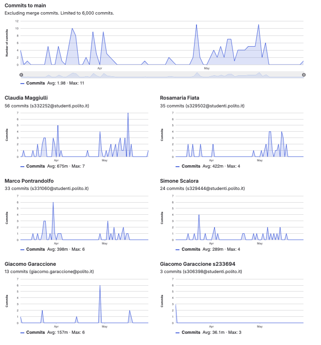

# Gruppo 5

## Valutazione deliverable V1

| gruppo | context diagram | business model | stakeholder | stories | interface | FR | NFR | use cases diagram | use cases | scenario | Glossary | DeploymentDiagram | functionality | estimation doc | precisione valori estimation | valutazione |
| --- | --- | --- | --- | --- | --- | --- | --- | --- | --- | --- | --- | --- | --- | --- | --- | --- |
| - | 1 | 0.5 | 0.5 | 1 | 1 | 3 | 3 | 1 | 5 | 5 | 5 | 2 | 1 | 2 | 2 | 33 |
| 5 | 100 | 100 | 95 | 100 | 100 | 95 | 100 | 100 | 100 | 100 | 95 | 90 | 100 | 70 | 60.29 | 95.41 |

## Valutazione deliverable V2

| gruppo | context diagram | business model | stakeholder | stories | interface | FR | NFR | ACCESS RIGHTS | use cases diagram | use cases | scenario | Glossary | DeploymentDiagram | functionality | estimation | precisione valori estimation | valutazione |
| --- | --- | --- | --- | --- | --- | --- | --- | --- | --- | --- | --- | --- | --- | --- | --- | --- | --- |
| - | 1 | 0.5 | 0.5 | 1 | 1 | 3 | 2 | 1 | 1 | 5 | 5 | 5 | 2 | 1 | 2 | 2 | 33 |
| 5 | 0 | 100 | 100 | 100 | 100 | 100 | 100 | 100 | 100 | 100 | 100 | 100 | 80 | 90 | 100 | 82.02 | 95.9 |

Le percentuali di v2 sono state riscalate in quanto la media pesata delle percentuali portava alcuni gruppi oltre al 100%.

## Valutazione codice e test (V2 + V3)

| Test Unit Totali | Test Unit Passati | Statement Coverage Unit | Branch Coverage Unit | Function Coverage Unit | Line Coverage Unit | Test Integration Totali | Test Integration Falliti | Statement Coverage Integration | Branch Coverage Integration | Function Coverage Integration | Line Coverage Integration | Correttezza V2 | Correttezza V3 | valutazione |
| --- | --- | --- | --- | --- | --- | --- | --- | --- | --- | --- | --- | --- | --- | --- |
| 1 | 0.5 | 2 | 2 | 1 | 1 | 1 | 0.5 | 2 | 2 | 1 | 1 | 16 | 2 | 33 |
| 100 | 90 | 100 | 100 | 100 | 100 | 100 | 90 | 100 | 75 | 100 | 100 | 91.5966386554622 | 100 | 94.11 |

 Unit e integration test prodotti dai gruppi sono stati eseguiti con la versione V2 del codice.

## Risultati Progetto

| Deliverable | Punteggio | Peso |
| --- | --- | --- |
| **Documenti V1** | 95.41% | 6 |
| **Documenti V2** | 94.61% | 2 |
| **Codice e Test** | 94.11% | 22 |
| **Timesheet** | 66.66% | 3 |
| **Valutazione** | 30.32 | 33 |
| **Valutazione** | 12.13 | 13.2 |

## Calcolo pesi progetto per singolo studente

| cognome | nome | email | gruppo | commit studente | commit totali | commit sul totale | coefficiente catme | coefficiente pesato | coefficiente progetto |
| --- | --- | --- | --- | --- | --- | --- | --- | --- | --- |
| FIATA | ROSAMARIA | s329502@studenti.polito.it | 5 | 35 | 148 | 0.24 | 0.80 | 0.69 | 0.75 |
| MAGGIULLI | CLAUDIA | s332252@studenti.polito.it | 5 | 56 | 148 | 0.38 | 1.05 | 0.92 | 1.00 |
| PONTRANDOLFO | MARCO | s331060@studenti.polito.it | 5 | 33 | 148 | 0.22 | 1.05 | 0.88 | 0.97 |
| SCALORA | SIMONE | s329444@studenti.polito.it | 5 | 24 | 148 | 0.16 | 0.91 | 0.76 | 0.83 |

 I pesi del progetto sono ottenuti per l'80% dal valore calcolato da CATME e per il 20% dalla percentuale dei commit del singolo studente sul totale dei commit effettuati dagli studenti dello stesso gruppo. Il risultato è stato poi riscalato in modo che il punteggio più alto del gruppo ottenesse 1.

## Studenti

| Nome | Matricola | Email | Bonus | Voto Primo Appello | Voto Secondo Appello | Voto Progetto | Voto Finale |
| --- | --- | --- | --- | --- | --- | --- | --- |
| SIMONE SCALORA | 329444 | s329444@studenti.polito.it | 0 | 13.7 | | 10.07 | 24 |
| CLAUDIA MAGGIULLI | 332252 | s332252@studenti.polito.it | 1 |  | 15.3 | 12.13 | 28 |
| MARCO PONTRANDOLFO | 331060 | s331060@studenti.polito.it | 1 |  | 15.9| 11.72 | 29 |
| ROSAMARIA FIATA | 329502 | s329502@studenti.polito.it | 1 | | 16.2 | 9.10 | 26 |
